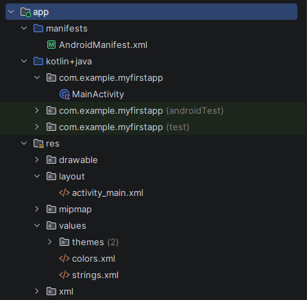

<div align="center">
МИНИСТЕРСТВО НАУКИ И ВЫСШЕГО ОБРАЗОВАНИЯ РОССИЙСКОЙ ФЕДЕРАЦИИ<br>
ФЕДЕРАЛЬНОЕ ГОСУДАРСТВЕННОЕ БЮДЖЕТНОЕ ОБРАЗОВАТЕЛЬНОЕ УЧРЕЖДЕНИЕ ВЫСШЕГО ОБРАЗОВАНИЯ<br>
«САХАЛИНСКИЙ ГОСУДАРСТВЕННЫЙ УНИВЕРСИТЕТ»
</div>


<br>
<br>

<div align="center">
Институт естественных наук и техносферной безопасности<br> 
Кафедра информатики<br>
Феофанов Артем
</div>


<br>
<br>
<br>
<br>

<div align="center">
Лабораторная работа №1<br>
«Создание первого проекта в Android Studio. Запуск на эмуляторе. Обзор интерфейса»<br>  
01.03.02 Прикладная математика и информатика
</div>

<br>
<br>
<br>
<br>
<br>
<br>
<br>
<br>
<br>
<br>
<br>
<br>
<br>

<div align="right">
Научный руководитель<br>
Соболев Евгений Игоревич
</div>

<br>
<br>
<br>

<div align="center">
г. Южно-Сахалинск<br>  
2026 г.
</div>

---

# Лабораторная работа №1
## Создание первого проекта в Android Studio. Запуск на эмуляторе. Обзор интерфейса

**Цель работы:** Ознакомиться со средой разработки Android Studio, создать и запустить простое приложение, изучить структуру проекта и базовые элементы интерфейса.

## Структура проекта


## Скриншот работающего приложения на эмуляторе/устройстве (после модификации)


## Листинг файла `activity_main.xml` с изменениями (если выполнялось инд. задание)

```xml
<?xml version="1.0" encoding="utf-8"?>
<androidx.constraintlayout.widget.ConstraintLayout xmlns:android="http://schemas.android.com/apk/res/android"
    xmlns:app="http://schemas.android.com/apk/res-auto"
    xmlns:tools="http://schemas.android.com/tools"
    android:id="@+id/main"
    android:layout_width="match_parent"
    android:layout_height="match_parent"
    tools:context=".MainActivity">

    <TextView
        android:layout_width="wrap_content"
        android:layout_height="wrap_content"
        android:text="@string/greeting"
        android:textSize="23sp"
        android:textColor="#0000FF"
        app:layout_constraintBottom_toBottomOf="parent"
        app:layout_constraintEnd_toEndOf="parent"
        app:layout_constraintStart_toStartOf="parent"
        app:layout_constraintTop_toTopOf="parent" />

    <TextView
        android:layout_width="wrap_content"
        android:layout_height="wrap_content"
        android:text="@string/test_app"
        android:layout_marginTop="50dp"
        android:textColor="#E91E63"
        app:layout_constraintBottom_toBottomOf="parent"
        app:layout_constraintEnd_toEndOf="parent"
        app:layout_constraintStart_toStartOf="parent"
        app:layout_constraintTop_toTopOf="parent" />

</androidx.constraintlayout.widget.ConstraintLayout>
```

## Контрольные вопросы

1. Проект Android может состоять из различных модулей. По умолчанию, когда мы создаем проект, создается один модуль - app. Модуль имеет три подпапки:

    * `manifests`: хранит файл манифеста `AndroidManifest.xml`, который описывает конфигурацию приложения и определяет каждый из компонентов данного приложения.

    * `java`: хранит файлы кода на языке java, которые структурированы по отдельным пакетам. 

    * `res`: содержит используемые в приложении ресурсы. Все ресурсы разбиты на подпапки.

        1. папка `drawable` предназначена для хранения изображений, используемых в приложении

        2. папка `layout` предназначена для хранения файлов, определяющих графический интерфейс. По умолчанию здесь есть файл `activity_main.xml`, который определяет интерфейс для класса MainActivity в виде xml

        3. папки `mipmap` содержат файлы изображений, которые предназначены для создания иконки приложения при различных разрешениях экрана.

        4. папка `values` хранит различные xml-файлы, содержащие коллекции ресурсов - различных данных, которые применяются в приложении. По умолчанию здесь есть два файла и одна папка:

            * файл `colors.xml` хранит описание цветов, используемых в приложении

            * файл `strings.xml` содержит строковые ресурсы, используемые в приложении

            * папки `themes` хранит две темы приложения - для светлую (дневную) и темную (ночную)

2. Файл `AndroidManifest.xml` описывает приложение (имя, иконка, активности, разрешения).

3. `minSdkVersion` и `targetSdkVersion` — это параметры в `build.gradle`, определяющие совместимость Android-приложения. `minSdkVersion` — минимальная версия ОС, на которой приложение запустится. `targetSdkVersion` — версия, под которую приложение оптимизировано и протестировано.

4. `AVD (Android Virtual Device)` — это эмулятор, имитирующий физическое Android-устройство на компьютере.

5. Изменение текста в Android-приложении без правки кода активности возможно через внешний ресурс `strings.xml`.

## Вывод
В ходе выполнения лабораторной работы была достигнута поставленная цель: произведено первичное ознакомление со средой разработки Android Studio, изучена структура типового проекта и выполнены практические действия по созданию и запуску простейшего Android-приложения.