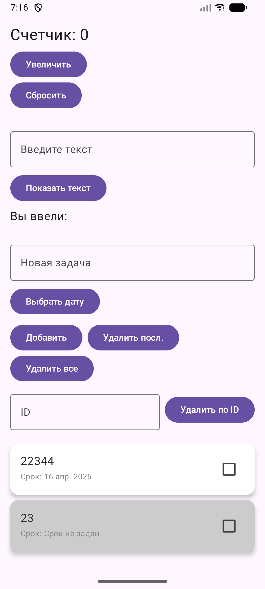

<div align="center">
МИНИСТЕРСТВО НАУКИ И ВЫСШЕГО ОБРАЗОВАНИЯ РОССИЙСКОЙ ФЕДЕРАЦИИ<br>
ФЕДЕРАЛЬНОЕ ГОСУДАРСТВЕННОЕ БЮДЖЕТНОЕ ОБРАЗОВАТЕЛЬНОЕ УЧРЕЖДЕНИЕ ВЫСШЕГО ОБРАЗОВАНИЯ<br>
«САХАЛИНСКИЙ ГОСУДАРСТВЕННЫЙ УНИВЕРСИТЕТ»
</div>


<br>
<br>

<div align="center">
Институт естественных наук и техносферной безопасности<br> 
Кафедра информатики<br>
Феофанов Артем
</div>


<br>
<br>
<br>
<br>

<div align="center">
Лабораторная работа №10<br>
«Интеграция Room в проект. Сохранение списка задач в БД»<br>  
01.03.02 Прикладная математика и информатика
</div>

<br>
<br>
<br>
<br>
<br>
<br>
<br>
<br>
<br>
<br>
<br>
<br>
<br>

<div align="right">
Научный руководитель<br>
Соболев Евгений Игоревич
</div>

<br>
<br>
<br>

<div align="center">
г. Южно-Сахалинск<br>  
2026 г.
</div>

---

# Лабораторная работа №10
## Интеграция Room в проект. Сохранение списка задач в БД

**Цель работы:** Изучить основы работы с Room Database — официальной библиотекой для работы с SQLite в Android. Научиться создавать Entity, DAO, Database, интегрировать Room с ViewModel и корутинами, обеспечить сохранение списка задач между сессиями приложения.


## Листинг файлов

### Файл `TaskEntity.kt`

```kotlin
package com.example.compose.data.local.entity

import androidx.room.Entity
import androidx.room.PrimaryKey

@Entity(tableName = "tasks")
data class TaskEntity(
    @PrimaryKey(autoGenerate = true)
    val id: Long = 0,
    val title: String,
    val isCompleted: Boolean = false,
    val createdTime: Long = System.currentTimeMillis(),
    val dueDate: Long? = null
)
```

### Файл `TaskDao.kt`

```kotlin
package com.example.compose.data.local.dao

import androidx.room.*
import com.example.compose.data.local.entity.TaskEntity
import kotlinx.coroutines.flow.Flow

@Dao
interface TaskDao {

    @Query("SELECT * FROM tasks ORDER BY createdTime DESC")
    fun getAllTasks(): Flow<List<TaskEntity>> // Возвращаем Flow для реактивного обновления

    @Insert(onConflict = OnConflictStrategy.REPLACE) // При конфликте заменять
    suspend fun insertTask(task: TaskEntity)

    @Update
    suspend fun updateTask(task: TaskEntity)

    @Delete
    suspend fun deleteTask(task: TaskEntity)

    @Query("DELETE FROM tasks")
    suspend fun deleteAll()

    @Query("SELECT * FROM tasks WHERE id = :id")
    suspend fun getTaskById(id: Long): TaskEntity?
}
```

### Файл `AppDatabase.kt`

```kotlin
package com.example.compose.data.local

import android.content.Context
import androidx.room.Database
import androidx.room.Room
import androidx.room.RoomDatabase
import com.example.compose.data.local.dao.TaskDao
import com.example.compose.data.local.entity.TaskEntity

@Database(
    entities = [TaskEntity::class],
    version = 1,
    exportSchema = false
)
abstract class AppDatabase : RoomDatabase() {
    abstract fun taskDao(): TaskDao

    companion object {
        @Volatile
        private var INSTANCE: AppDatabase? = null

        fun getInstance(context: Context): AppDatabase {
            return INSTANCE ?: synchronized(this) {
                val instance = Room.databaseBuilder(
                    context.applicationContext,
                    AppDatabase::class.java,
                    "todo_database"
                )
                    //.fallbackToDestructiveMigration() // Для разработки: при изменении версии БД пересоздавать таблицы
                    .build()
                INSTANCE = instance
                instance
            }
        }
    }
}
```

### Файл `MainViewModel.kt`

```kotlin
package com.example.compose

import androidx.lifecycle.ViewModel
import androidx.lifecycle.viewModelScope
import com.example.compose.data.local.AppDatabase
import com.example.compose.data.local.entity.TaskEntity
import kotlinx.coroutines.flow.*
import kotlinx.coroutines.launch

class MainViewModel(
    private val database: AppDatabase
) : ViewModel() {

    private val taskDao = database.taskDao()

    val tasks: StateFlow<List<TaskEntity>> = taskDao.getAllTasks()
        .stateIn(
            scope = viewModelScope,
            started = SharingStarted.WhileSubscribed(5000),
            initialValue = emptyList()
        )

    fun addTask(title: String, dueDate: Long?) {
        viewModelScope.launch {
            val task = TaskEntity(title = title, dueDate = dueDate)
            taskDao.insertTask(task)
        }
    }

    fun deleteTask(task: TaskEntity) {
        viewModelScope.launch {
            taskDao.deleteTask(task)
        }
    }

    fun updateTask(task: TaskEntity, newText: String) {
        viewModelScope.launch {
            taskDao.updateTask(task.copy(title = newText))
        }
    }

    fun toggleTaskCompletion(task: TaskEntity, isCompleted: Boolean) {
        viewModelScope.launch {
            val updatedTask = task.copy(isCompleted = isCompleted)
            taskDao.updateTask(updatedTask)
        }
    }

    fun restoreTask(task: TaskEntity) {
        viewModelScope.launch {
            taskDao.insertTask(task)
        }
    }

    fun deleteAllTasks() {
        viewModelScope.launch {
            taskDao.deleteAll()
        }
    }

    fun deleteTaskByIndex(index: Int) {
        val currentList = tasks.value
        if (index in currentList.indices) {
            deleteTask(currentList[index])
        }
    }
}
```

### Файл `MainActivity.kt`

```kotlin
package com.example.compose

import android.os.Bundle
import android.widget.Toast
import androidx.activity.ComponentActivity
import androidx.activity.compose.setContent
import androidx.activity.enableEdgeToEdge
import androidx.activity.viewModels
import androidx.compose.foundation.ExperimentalFoundationApi
import androidx.compose.foundation.background
import androidx.compose.foundation.combinedClickable
import androidx.compose.foundation.layout.*
import androidx.compose.foundation.lazy.LazyColumn
import androidx.compose.foundation.lazy.itemsIndexed
import androidx.compose.foundation.text.KeyboardOptions
import androidx.compose.material.icons.Icons
import androidx.compose.material.icons.filled.Delete
import androidx.compose.material3.*
import androidx.compose.runtime.*
import androidx.compose.runtime.saveable.rememberSaveable
import androidx.compose.ui.Alignment
import androidx.compose.ui.Modifier
import androidx.compose.ui.graphics.Color
import androidx.compose.ui.platform.LocalContext
import androidx.compose.ui.text.input.KeyboardType
import androidx.compose.ui.text.style.TextDecoration
import androidx.compose.ui.unit.dp
import androidx.compose.ui.unit.sp
import androidx.navigation.NavController
import androidx.navigation.NavType
import androidx.navigation.compose.*
import androidx.navigation.compose.rememberNavController
import androidx.navigation.navArgument
import kotlinx.coroutines.launch
import com.example.compose.data.local.AppDatabase
import com.example.compose.data.local.entity.TaskEntity
import java.text.SimpleDateFormat
import java.util.Calendar
import java.util.Date
import java.util.Locale
import java.util.TimeZone

class MainActivity : ComponentActivity() {
    private val database by lazy { AppDatabase.getInstance(this) }
    private val viewModel: MainViewModel by viewModels {
        MainViewModelFactory(database)
    }

    override fun onCreate(savedInstanceState: Bundle?) {
        super.onCreate(savedInstanceState)
        enableEdgeToEdge()

        setContent {
            MaterialTheme {
                Surface(
                    modifier = Modifier.fillMaxSize(),
                    color = MaterialTheme.colorScheme.background
                ) {
                    AppNavigation(viewModel)
                }
            }
        }
    }
}

@Composable
fun AppNavigation(viewModel: MainViewModel) {
    val navController = rememberNavController()

    NavHost(navController = navController, startDestination = "main") {
        composable("main") {
            MainScreen(viewModel, navController)
        }
        composable(
            route = "detail/{position}",
            arguments = listOf(navArgument("position") { type = NavType.IntType })
        ) { backStackEntry ->
            val position = backStackEntry.arguments?.getInt("position") ?: -1
            DetailScreen(position, viewModel, navController)
        }
    }
}

@OptIn(ExperimentalMaterial3Api::class)
@Composable
fun MainScreen(viewModel: MainViewModel, navController: NavController) {
    val tasks by viewModel.tasks.collectAsState()
    val context = LocalContext.current
    val coroutineScope = rememberCoroutineScope()
    val snackbarHostState = remember { SnackbarHostState() }

    var counter by rememberSaveable { mutableIntStateOf(0) }
    var inputEchoText by rememberSaveable { mutableStateOf("") }
    var displayedEchoText by rememberSaveable { mutableStateOf("Вы ввели:") }
    var newTaskText by rememberSaveable { mutableStateOf("") }
    var deleteTaskId by rememberSaveable { mutableStateOf("") }

    var editDialogTask by rememberSaveable { mutableStateOf<TaskEntity?>(null) }
    var editDialogText by rememberSaveable { mutableStateOf("") }

    var selectedDueDate by rememberSaveable { mutableStateOf<Long?>(null) }
    var showDatePicker by rememberSaveable { mutableStateOf(false) }

    Scaffold(
        snackbarHost = { SnackbarHost(snackbarHostState) },
        modifier = Modifier.fillMaxSize()
    ) { innerPadding ->
        LazyColumn(
            contentPadding = innerPadding,
            modifier = Modifier
                .fillMaxSize()
                .padding(16.dp)
        ) {
            item {
                Text(text = "Счетчик: $counter", fontSize = 24.sp)
                Spacer(modifier = Modifier.height(8.dp))
                Button(onClick = { counter++ }) { Text("Увеличить") }
                Button(onClick = { counter = 0 }) { Text("Сбросить") }
                Spacer(modifier = Modifier.height(24.dp))
            }

            item {
                OutlinedTextField(
                    value = inputEchoText,
                    onValueChange = { inputEchoText = it },
                    label = { Text("Введите текст") },
                    modifier = Modifier.fillMaxWidth()
                )
                Spacer(modifier = Modifier.height(8.dp))
                Button(onClick = { displayedEchoText = "Вы ввели: $inputEchoText" }) {
                    Text("Показать текст")
                }
                Spacer(modifier = Modifier.height(8.dp))
                Text(text = displayedEchoText, fontSize = 18.sp)
                Spacer(modifier = Modifier.height(24.dp))
            }

            item {
                OutlinedTextField(
                    value = newTaskText,
                    onValueChange = { newTaskText = it },
                    label = { Text("Новая задача") },
                    modifier = Modifier.fillMaxWidth()
                )
                Spacer(modifier = Modifier.height(8.dp))

                // Кнопка выбора даты
                Row(verticalAlignment = Alignment.CenterVertically) {
                    Button(onClick = {
                        showDatePicker = true
                    }) {
                        Text(if (selectedDueDate == null) "Выбрать дату" else formatTimestamp(selectedDueDate))
                    }
                    if (selectedDueDate != null) {
                        TextButton(onClick = { selectedDueDate = null }) {
                            Text("Сбросить дату", color = Color.Black)
                        }
                    }
                }

                Spacer(modifier = Modifier.height(8.dp))

                Row(horizontalArrangement = Arrangement.spacedBy(8.dp)) {
                    Button(onClick = {
                        if (newTaskText.isNotBlank()) {
                            viewModel.addTask(newTaskText, selectedDueDate)
                            newTaskText = ""
                        } else {
                            Toast.makeText(context, "Введите задачу", Toast.LENGTH_SHORT).show()
                        }
                    }) { Text("Добавить") }

                    Button(onClick = {
                        if (tasks.isNotEmpty()) {
                            viewModel.deleteTaskByIndex(tasks.lastIndex)
                        } else {
                            Toast.makeText(context, "Список пуст", Toast.LENGTH_SHORT).show()
                        }
                    }) { Text("Удалить посл.") }
                }

                Button(onClick = {
                    if (tasks.isNotEmpty()) viewModel.deleteAllTasks()
                    else Toast.makeText(context, "Список пуст", Toast.LENGTH_SHORT).show()
                }) { Text("Удалить все") }

                Spacer(modifier = Modifier.height(8.dp))

                Row(
                    modifier = Modifier.fillMaxWidth(),
                    horizontalArrangement = Arrangement.spacedBy(8.dp),
                    verticalAlignment = Alignment.CenterVertically
                ) {
                    OutlinedTextField(
                        value = deleteTaskId,
                        onValueChange = { deleteTaskId = it },
                        label = { Text("ID") },
                        keyboardOptions = KeyboardOptions(keyboardType = KeyboardType.Number),
                        modifier = Modifier.weight(1f)
                    )
                    Button(onClick = {
                        val id = deleteTaskId.toIntOrNull()
                        if (id != null) {
                            if (id - 1 in tasks.indices) {
                                viewModel.deleteTaskByIndex(id - 1)
                            } else {
                                Toast.makeText(context, "Такой номер задачи не существует", Toast.LENGTH_SHORT).show()
                            }
                        } else {
                            Toast.makeText(context, "Номер должен быть целым числом", Toast.LENGTH_SHORT).show()
                        }
                    }) { Text("Удалить по ID") }
                }
                Spacer(modifier = Modifier.height(16.dp))
            }

            itemsIndexed(
                items = tasks,
                key = { _, task -> task.id }
            ) { index, task ->
                val dismissState = rememberSwipeToDismissBoxState(
                    confirmValueChange = { dismissValue ->
                        if (dismissValue == SwipeToDismissBoxValue.EndToStart) {
                            val deletedTask = task
                            viewModel.deleteTask(task)
                            coroutineScope.launch {
                                val result = snackbarHostState.showSnackbar(
                                    message = "Задача удалена",
                                    actionLabel = "Отмена"
                                )
                                if (result == SnackbarResult.ActionPerformed) {
                                    viewModel.restoreTask(deletedTask)
                                }
                            }
                            true
                        } else false
                    }
                )

                SwipeToDismissBox(
                    state = dismissState,
                    enableDismissFromStartToEnd = false,
                    backgroundContent = {
                        val color = if (dismissState.targetValue == SwipeToDismissBoxValue.EndToStart) Color.Red else Color.Transparent
                        Box(
                            Modifier
                                .fillMaxSize()
                                .padding(vertical = 4.dp)
                                .background(color)
                                .padding(end = 16.dp),
                            contentAlignment = Alignment.CenterEnd
                        ) {
                            Icon(Icons.Default.Delete, contentDescription = "Удалить", tint = Color.White)
                        }
                    }
                ) {
                    val bgColor = if (index % 2 == 0) Color.White else Color.LightGray

                    TaskItem(
                        task = task,
                        backgroundColor = bgColor,
                        onClick = { navController.navigate("detail/$index") },
                        onLongClick = {
                            editDialogTask = task
                            editDialogText = task.title
                        },
                        onCheckedChange = { isChecked ->
                            viewModel.toggleTaskCompletion(task, isChecked)
                        }
                    )
                }
            }
        }
    }

    if (editDialogTask != null) {
        val currentTask = editDialogTask!!

        AlertDialog(
            onDismissRequest = { editDialogTask = null },
            title = { Text("Редактировать задачу") },
            text = {
                OutlinedTextField(
                    value = editDialogText,
                    onValueChange = { editDialogText = it }
                )
            },
            confirmButton = {
                TextButton(onClick = {
                    if (editDialogText.isNotBlank()) {
                        viewModel.updateTask(currentTask, editDialogText)
                    }
                    editDialogTask = null
                }) { Text("Сохранить") }
            },
            dismissButton = {
                TextButton(onClick = { editDialogTask = null }) { Text("Отмена") }
            }
        )
    }

    if (showDatePicker) {
        ShowDatePicker(
            onDateSelected = { timestamp ->
                if (timestamp != null) {
                    selectedDueDate = timestamp
                }
            },
            onDismiss = { showDatePicker = false }
        )
    }
}

@OptIn(ExperimentalFoundationApi::class)
@Composable
fun TaskItem(
    task: TaskEntity,
    backgroundColor: Color,
    onClick: () -> Unit,
    onLongClick: () -> Unit,
    onCheckedChange: (Boolean) -> Unit
) {
    val isChecked = task.isCompleted

    Card(
        modifier = Modifier
            .fillMaxWidth()
            .padding(vertical = 4.dp)
            .combinedClickable(
                onClick = onClick,
                onLongClick = onLongClick
            ),
        elevation = CardDefaults.cardElevation(defaultElevation = 4.dp),
        colors = CardDefaults.cardColors(containerColor = backgroundColor)
    ) {
        Row(
            modifier = Modifier
                .fillMaxWidth()
                .padding(16.dp),
            verticalAlignment = Alignment.CenterVertically
        ) {
            Column(modifier = Modifier.weight(1f)) {
                Text(
                    text = task.title,
                    fontSize = 18.sp,
                    textDecoration = if (isChecked) TextDecoration.LineThrough else TextDecoration.None,
                    color = Color(0xFF333333)
                )
                Text(
                    text = "Срок: ${formatTimestamp(task.dueDate)}",
                    fontSize = 12.sp,
                    color = Color.Gray
                )
            }

            Checkbox(
                checked = isChecked,
                onCheckedChange = onCheckedChange
            )
        }
    }
}

@OptIn(ExperimentalMaterial3Api::class)
@Composable
fun ShowDatePicker(
    onDateSelected: (Long?) -> Unit,
    onDismiss: () -> Unit
) {
    val datePickerState = rememberDatePickerState(
        selectableDates = object : SelectableDates {
            override fun isSelectableDate(utcTimeMillis: Long): Boolean {
                return utcTimeMillis >= System.currentTimeMillis() - 24 * 60 * 60 * 1000
            }
        }
    )

    DatePickerDialog(
        onDismissRequest = onDismiss,
        confirmButton = {
            TextButton(onClick = {
                onDateSelected(datePickerState.selectedDateMillis)
                onDismiss()
            }) {
                Text("ОК")
            }
        },
        dismissButton = {
            TextButton(onClick = onDismiss) {
                Text("Отмена")
            }
        }
    ) {
        DatePicker(state = datePickerState)
    }
}

@Composable
fun DetailScreen(position: Int, viewModel: MainViewModel, navController: NavController) {
    val tasks by viewModel.tasks.collectAsState()
    val task = tasks.getOrNull(position)

    if (task == null) {
        LaunchedEffect(Unit) { navController.popBackStack() }
        return
    }

    var text by rememberSaveable { mutableStateOf(task.title) }

    Scaffold { innerPadding ->
        Column(
            modifier = Modifier
                .fillMaxSize()
                .padding(innerPadding)
                .padding(16.dp),
            horizontalAlignment = Alignment.CenterHorizontally
        ) {
            Text(
                text = "Детали задачи",
                fontSize = 24.sp,
                modifier = Modifier.padding(bottom = 24.dp)
            )

            OutlinedTextField(
                value = text,
                onValueChange = { text = it },
                modifier = Modifier
                    .fillMaxWidth()
                    .padding(bottom = 16.dp),
                textStyle = LocalTextStyle.current.copy(fontSize = 18.sp)
            )

            Button(onClick = {
                if (text.isNotBlank()) {
                    viewModel.updateTask(task, text)
                    navController.popBackStack()
                }
            }) {
                Text("Сохранить и вернуться")
            }

            Spacer(modifier = Modifier.height(8.dp))

            Button(
                onClick = {
                    viewModel.deleteTask(task)
                    navController.popBackStack()
                },
                colors = ButtonDefaults.buttonColors(containerColor = MaterialTheme.colorScheme.error)
            ) {
                Text("Удалить задачу")
            }
        }
    }
}

fun formatTimestamp(timestamp: Long?): String {
    if (timestamp == null) return "Срок не задан"
    val date = Date(timestamp)
    val formatter = SimpleDateFormat("dd MMM yyyy", Locale("ru", "RU"))
    formatter.timeZone = TimeZone.getTimeZone("UTC")

    return formatter.format(date)
}
```

## Скриншоты работающего приложения



## Контрольные вопросы

1. `Room` - это `ORM-библиотека`, которая является абстракцией над стандартным `SQLite`. Прямое использование `SQLite` несло в себе много проблем, которые `Room` успешно решает:
    * Огромное количество шаблонного кода.
    * Отсутствие проверки на этапе компиляции.
    * Сложность работы с потоками и реактивностью.

2. Архитектура `Room` держится на:
    * `Entity`: Это обычный `data class`, помеченный аннотацией `@Entity`. Он представляет собой структуру таблицы в базе данных. Каждое поле класса - это колонка в таблице, а экземпляр класса - это строка.
    * `DAO (Data Access Object)`: Интерфейс с аннотацией `@Dao`. Это место, где описывается, как именно нужно работать с данными (методы для поиска, удаления, обновления и вставки). Вместо написания кода выполнения запроса просто ставятся аннотации вроде `@Insert` или `@Query("SELECT * FROM ...")`.
    * `Database`: Абстрактный класс с аннотацией `@Database`, расширяющий `RoomDatabase`. Это главный координатор и точка входа. Он связывает сущности с DAO и служит для создания или очистки самой базы данных.

3. `База данных` работает с файловой системой устройства. Операции чтения и особенно записи - это тяжелые `I/O операции`.

    Если запустить такую операцию на главном потоке, который отвечает за отрисовку интерфейса и т. д., этот поток заблокируется. Пользователь увидит застывший экран, а операционная система Android через несколько секунд выдаст ошибку `Приложение не отвечает` и закроет приложение.

    Ключевое слово `suspend` заставляет Room выполнять эти операции асинхронно, автоматически переключаясь на фоновые потоки, не блокируя `UI`.

4. `Flow` - это `асинхронный поток данных`, который может поочередно выдавать вычисленные значения. Почему это удобно:
    * Вы подписываетесь на этот `Flow` в UI (через `collectAsState()`).
    * Как только вы (или какой-то фоновый процесс) добавляете, удаляете или изменяете задачу в БД, `Room` автоматически замечает изменения.
    * Он сам заново делает `SQL-запрос` в фоне и «выталкивает» свежий список в этот Flow.
    * Интерфейс вашего `Compose-экрана` мгновенно перерисовывается. Вам не нужно вручную обновлять списки после каждого действия.

5. Room делает это с помощью плагинов обработки аннотаций:
    * `KSP` сканирует ваш код и находит аннотации вроде `@Query("SELECT * FROM tasks WHERE id = :id")`.
    * Компилятор `Room` разбирает эту строку-запрос и сопоставляет её с вашими классами `@Entity`.
    * Он проверяет: существует ли таблица `tasks`? Есть ли у неё колонка `id`? Совпадает ли тип данных? Правильно ли написаны ключевые слова `SQLite`?
    * Если есть опечатка (например, написали `SELECT * FROM task_table`), `Room` прервет сборку проекта и выдаст понятную ошибку в логах компиляции. Код просто не скомпилируется в `.apk`.

6. Создание экземпляра базы данных - это очень дорогая операция с точки зрения производительности и памяти. `Singleton` решает две важные задачи:
    * Экономия ресурсов: База данных инициализируется всего один раз за всё время жизни приложения. Все последующие обращения к ней просто возвращают уже готовый объект, созданный в памяти.
    * Предотвращение конфликтов: Если у вас будет открыто несколько независимых подключений к одному и тому же файлу базы данных из разных мест приложения, они могут попытаться одновременно записать данные в один и тот же сектор. Это приведет к блокировке базы, крашам или повреждению данных. Единственный экземпляр гарантирует строгую очередность транзакций.

## Вывод
В ходе выполнения лабораторной работы были изучены основные механизмы организации локального хранения данных и обеспечения реактивности пользовательского интерфейса в `Jetpack Compose` с использованием компонента `Room`. Я ознакомился с устройством сущностей, DAO. Была освоена интеграция реактивных запросов базы данных с `ViewModel` посредством `StateFlow` для автоматического и изолированного обновления `UI` при любых изменениях в таблице.