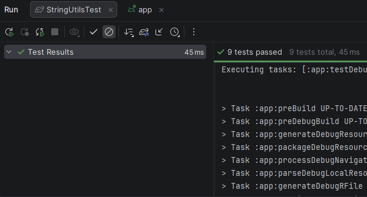
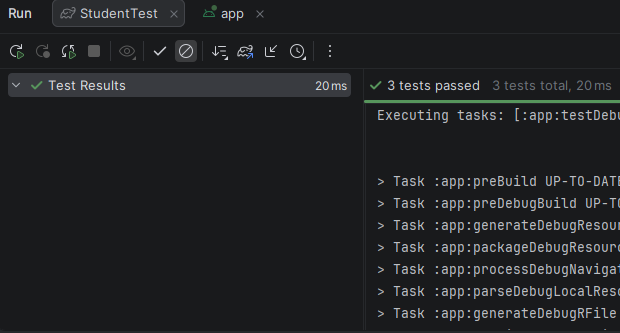

<div align="center">
МИНИСТЕРСТВО НАУКИ И ВЫСШЕГО ОБРАЗОВАНИЯ РОССИЙСКОЙ ФЕДЕРАЦИИ<br>
ФЕДЕРАЛЬНОЕ ГОСУДАРСТВЕННОЕ БЮДЖЕТНОЕ ОБРАЗОВАТЕЛЬНОЕ УЧРЕЖДЕНИЕ ВЫСШЕГО ОБРАЗОВАНИЯ<br>
«САХАЛИНСКИЙ ГОСУДАРСТВЕННЫЙ УНИВЕРСИТЕТ»
</div>


<br>
<br>

<div align="center">
Институт естественных наук и техносферной безопасности<br> 
Кафедра информатики<br>
Феофанов Артем
</div>


<br>
<br>
<br>
<br>

<div align="center">
Лабораторная работа №2<br>
«Написание консольных утилит на Kotlin внутри Android проекта. Расчеты, работа со строками. Подготовка классов данных для будущего приложения»<br>  
01.03.02 Прикладная математика и информатика
</div>

<br>
<br>
<br>
<br>
<br>
<br>
<br>
<br>
<br>
<br>
<br>
<br>
<br>

<div align="right">
Научный руководитель<br>
Соболев Евгений Игоревич
</div>

<br>
<br>
<br>

<div align="center">
г. Южно-Сахалинск<br>  
2026 г.
</div>

---

# Лабораторная работа №2
## Написание консольных утилит на Kotlin внутри Android проекта. Расчеты, работа со строками. Подготовка классов данных для будущего приложения

**Цель работы:** Научиться создавать классы данных и функции-утилиты на Kotlin в контексте Android-проекта, освоить базовые приёмы работы со строками и числами, познакомиться с юнит-тестированием для проверки корректности кода.

## Листинг файлов


### Класс данных `Book`

Был создан класс `Book`, который хранит поля, хранящие название книги, имя автора, год издания и цену.

```kotlin
package com.example.myfirstapp.utils

data class Book(
    val title: String,
    val author: String,
    val year: Int,
    val price: Double,
)
```

### Файл для функций-утилит `StringUtils.kt`

Был создан файл `StringUtils.kt`, который хранит функции, проверяющую строку с почтой на валидность, форматирующую имя автора и применяющую скидку к цене книги.

```kotlin
package com.example.myfirstapp.utils

fun String.isValidEmail(): Boolean {
    return this.contains("@") && this.contains(".")
}

fun formatAuthorName(fullName: String): String {
    val parts = fullName.split(" ").filter { it.isNotBlank() }
    return when (parts.size) {
        1 -> parts[0]
        2 -> "${parts[0]} ${parts[1].first()}."
        3 -> "${parts[0]} ${parts[1].first()}.${parts[2].first()}."
        else -> fullName
    }
}

fun applyDiscount(price: Double, discountPercent: Double): Double {
    require(discountPercent in 0.0..100.0) { "Скидка должна быть от 0 до 100" }
    return price * (1 - discountPercent / 100)
}
```

### Класс данных `Student` (индивидуальное задание)

При выполнении индивидуального задания был создан класс данных `Student`, который содержит поля, хранящие имя и фамилию студента, группу и средний балл, и функции для форматирования имени и получения статуса студента.

```kotlin
package com.example.myfirstapp.utils

data class Student(
    val name: String,
    val surname: String,
    val groupName: String,
    val avgMark: Double,
) {
    fun formatStudentName(): String {
        val fName = if (name.isNotEmpty()) "${name.first()}." else ""
        val sName = if (surname.isNotEmpty()) "${surname}" else ""
        val group = if (groupName.isNotEmpty()) "${groupName}" else ""

        return "$sName $fName (группа $group)"
    }

    fun getStatus(): String {
        return when {
            avgMark >= 4.5 -> "отличник"
            avgMark >= 3.5 -> "хорошист"
            avgMark >= 2.5 -> "троечник"
            else -> "двоечник"
        }
    }
}
```

### Тесты для `StringUtils`

Были созданы тесты для функций `StringUtils`.

```kotlin
package com.example.myfirstapp.utils

import org.junit.Assert.*
import org.junit.Test

class StringUtilsTest {
    @Test
    fun emailValidation_correct() {
        assertTrue("test@example.com".isValidEmail())
        assertTrue("user.name@domain.co".isValidEmail())
    }

    @Test
    fun emailValidation_incorrect() {
        assertFalse("testexample.com".isValidEmail())
        assertFalse("test@example".isValidEmail())
        assertFalse("".isValidEmail())
    }

    @Test
    fun formatAuthorName_fullName() {
        assertEquals("Толстой Л.Н.", formatAuthorName("Толстой Лев Николаевич"))
        assertEquals("Пушкин А.С.", formatAuthorName("Пушкин Александр Сергеевич"))
    }

    @Test
    fun formatAuthorName_twoParts() {
        assertEquals("Толстой Л.", formatAuthorName("Толстой Лев"))
        assertEquals("Пушкин А.", formatAuthorName("Пушкин Александр"))
    }

    @Test
    fun formatAuthorName_onePart() {
        assertEquals("Толстой", formatAuthorName("Толстой"))
    }

    @Test
    fun applyDiscount_normal() {
        assertEquals(90.0, applyDiscount(100.0, 10.0), 0.001)
        assertEquals(75.0, applyDiscount(150.0, 50.0), 0.001)
    }

    @Test
    fun applyDiscount_zero() {
        assertEquals(100.0, applyDiscount(100.0, 0.0), 0.001)
    }

    @Test(expected = IllegalArgumentException::class)
    fun applyDiscount_invalidLow() {
        applyDiscount(100.0, -5.0)
    }

    @Test(expected = IllegalArgumentException::class)
    fun applyDiscount_invalidHigh() {
        applyDiscount(100.0, 110.0)
    }
}
```

### Тесты для `Student`

Были созданы тесты для функций класса `Student`.

```kotlin
package com.example.myfirstapp.utils

import org.junit.Assert.*
import org.junit.Test

class StudentTest {

    @Test
    fun formatStudentName_correct() {
        val student = Student("Иван", "Иванов", "ПИ-101", 4.8)
        assertEquals("Иванов И. (группа ПИ-101)", student.formatStudentName())
    }

    @Test
    fun getStatus_correct() {
        val excellent = Student("Аня", "Петрова", "ПИ-101", 4.5)
        val good = Student("Борис", "Сидоров", "ПИ-101", 3.8)
        val satisfactory = Student("Виктор", "Кузнецов", "ПИ-101", 3.0)
        val failing = Student("Глеб", "Белов", "ПИ-101", 2.0)

        assertEquals("отличник", excellent.getStatus())
        assertEquals("хорошист", good.getStatus())
        assertEquals("троечник", satisfactory.getStatus())
        assertEquals("двоечник", failing.getStatus())
    }

    @Test
    fun formatStudentName_emptyFirstName() {
        val student = Student("", "Смит", "Inter-1", 4.0)
        assertEquals("Смит  (группа Inter-1)", student.formatStudentName())
    }
}
```

## Скриншот выполнения тестов

### Тесты для `StringUtils`



### Тесты для `Student`



## Скриншот приложения (интеграция с UI)


## Контрольные вопросы

1. `Data class` в Kotlin — это класс, предназначенный для хранения данных. Автоматически генерирует полезные методы: `equals()`, `hashCode()`, `toString()`, `copy()` и `componentN()` (для деструктуризации).

2. Функции расширения позволяют добавить функционал к уже определенным типам. При этом типы могут быть определены где-то в другом месте, например, в стандартной библиотеке. Например: для типа Int можно определить функцию возведения в квадрат

```kotlin
fun Int.square(): Int{
    return this * this
}

4.square()  // 16
```

3. Для написания unit‑тестов в Android используется фреймворк `JUnit`. При написании unit‑тестов рекомендуется создавать класс с приставкой «Test», сам же тест создается путем аннотации `@Test` над методом, который обязательно должен быть публичным. Чтобы запустить все тесты, щелкните правой кнопкой мыши на папке `src/test/java` и выберите `Run Tests` (или на конкретном файле теста).

4. `assertEquals()` — это метод в библиотеке `JUnit`, который используется для проверки, что два объекта равны друг другу. Если они равны, тест проходит успешно. Если не равны, тест завершается с ошибкой, и мы увидим сообщение о том, что ожидаемое значение не совпало с фактическим. Для тестов с вещественными числами используют `assertEquals(expected, actual, delta)`, где `delta` – допустимая погрешность.


5. В стандартной структуре Gradle проектов на JVM исходные коды тестов хранятся в директории `src/test/java`.

## Вывод
В ходе выполнения лабораторной работы была достигнута поставленная цель: создавать классы данных `Book` и `Student` и функции-утилиты `StringUtils`, освоены базовые приёмы работы со строками и числами, юнит-тестирование с помощью `JUnit` для проверки корректности кода.