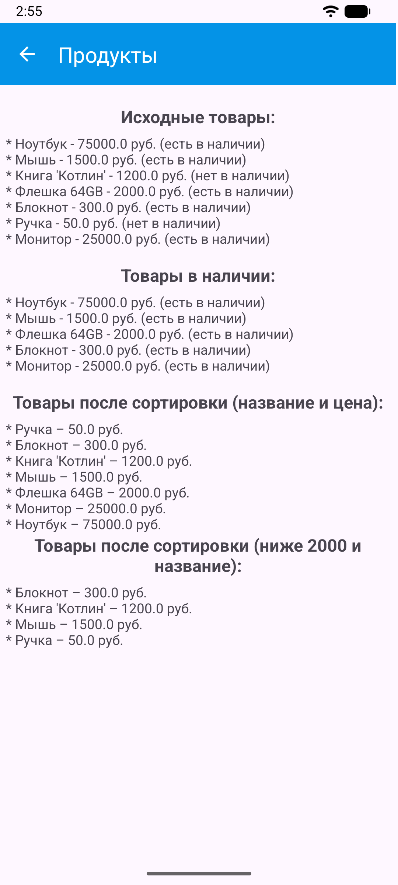
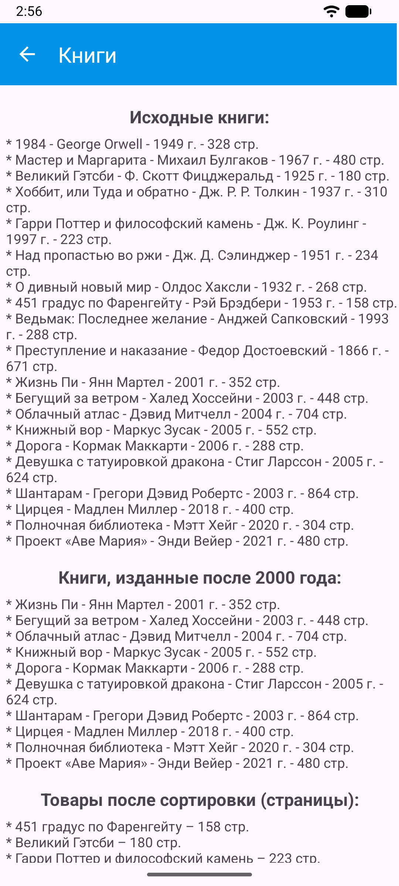
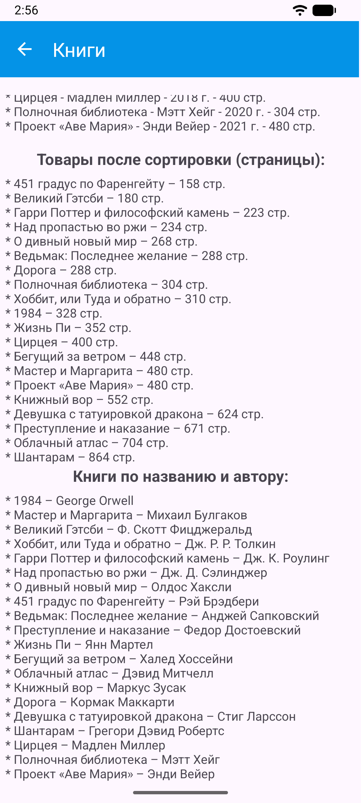

<div align="center">
МИНИСТЕРСТВО НАУКИ И ВЫСШЕГО ОБРАЗОВАНИЯ РОССИЙСКОЙ ФЕДЕРАЦИИ<br>
ФЕДЕРАЛЬНОЕ ГОСУДАРСТВЕННОЕ БЮДЖЕТНОЕ ОБРАЗОВАТЕЛЬНОЕ УЧРЕЖДЕНИЕ ВЫСШЕГО ОБРАЗОВАНИЯ<br>
«САХАЛИНСКИЙ ГОСУДАРСТВЕННЫЙ УНИВЕРСИТЕТ»
</div>


<br>
<br>

<div align="center">
Институт естественных наук и техносферной безопасности<br> 
Кафедра информатики<br>
Феофанов Артем
</div>


<br>
<br>
<br>
<br>

<div align="center">
Лабораторная работа №3<br>
«Реализация списка объектов с фильтрацией с использованием .map, .filter, .sortedBy»<br>  
01.03.02 Прикладная математика и информатика
</div>

<br>
<br>
<br>
<br>
<br>
<br>
<br>
<br>
<br>
<br>
<br>
<br>
<br>

<div align="right">
Научный руководитель<br>
Соболев Евгений Игоревич
</div>

<br>
<br>
<br>

<div align="center">
г. Южно-Сахалинск<br>  
2026 г.
</div>

---

# Лабораторная работа №3
## Реализация списка объектов с фильтрацией с использованием .map, .filter, .sortedBy

**Цель работы:** Изучить функциональные методы обработки коллекций в Kotlin (filter, map, sortedBy) на примере списка объектов и вывести результаты в интерфейс Android-приложения.

## Листинг файлов


### Класс данных `Product`

Был создан класс `Product`, который хранит поля, содержащие название товара, категорию, цену и наличие.

```kotlin
package com.example.mynotfirstapp.models

data class Product(
    val name: String,
    val category: String,
    val price: Double,
    val inStock: Boolean
)
```

### Файл `ProductActivity.kt`

Был создан файл `ProductActivity.kt`, который хранит логику запуска активности и фильтрации продуктов.

```kotlin
package com.example.mynotfirstapp

import android.os.Bundle
import android.widget.TextView
import androidx.activity.enableEdgeToEdge
import androidx.appcompat.app.AppCompatActivity
import androidx.appcompat.widget.Toolbar
import androidx.core.view.ViewCompat
import androidx.core.view.WindowInsetsCompat
import com.example.mynotfirstapp.models.Product

class ProductActivity : AppCompatActivity() {
    override fun onCreate(savedInstanceState: Bundle?) {
        super.onCreate(savedInstanceState)
        enableEdgeToEdge()
        setContentView(R.layout.activity_product)
        ViewCompat.setOnApplyWindowInsetsListener(findViewById(R.id.main)) { v, insets ->
            val systemBars = insets.getInsets(WindowInsetsCompat.Type.systemBars())
            v.setPadding(systemBars.left, systemBars.top, systemBars.right, systemBars.bottom)
            insets
        }

        val products = getProducts()

        val originalText = products.joinToString("\n") { "* ${it.name} - ${it.price} руб." +
                " (${if (it.inStock) "есть в наличии" else "нет в наличии"})" }
        findViewById<TextView>(R.id.textOriginal).text = originalText

        val inStockText = products.filter { it.inStock }.joinToString("\n") { "* ${it.name} - ${it.price} руб." +
                " (${if (it.inStock) "есть в наличии" else "нет в наличии"})" }
        findViewById<TextView>(R.id.textInStock).text = inStockText

        val sorted_1Text = products.sortedBy { it.name }.sortedBy { it.price }.map { "* ${it.name} – ${it.price} руб." }
        val sort_1Text = sorted_1Text.joinToString("\n")
        findViewById<TextView>(R.id.textSorted_1).text = sort_1Text

        val sorted_2Text = products.filter { it.price < 2000.0 }.sortedBy { it.name }.map { "* ${it.name} – ${it.price} руб." }
        val sort_2Text = sorted_2Text.joinToString("\n")
        findViewById<TextView>(R.id.textSorted_2).text = sort_2Text

        val toolbar: Toolbar = findViewById(R.id.toolbar)
        setSupportActionBar(toolbar)
        supportActionBar?.setDisplayHomeAsUpEnabled(true)
        supportActionBar?.setDisplayShowHomeEnabled(true);
    }

    private fun getProducts(): List<Product> {
        return listOf(
            Product("Ноутбук", "Электроника", 75000.0, true),
            Product("Мышь", "Электроника", 1500.0, true),
            Product("Книга 'Котлин'", "Книги", 1200.0, false),
            Product("Флешка 64GB", "Электроника", 2000.0, true),
            Product("Блокнот", "Канцелярия", 300.0, true),
            Product("Ручка", "Канцелярия", 50.0, false),
            Product("Монитор", "Электроника", 25000.0, true)
        )
    }

    override fun onSupportNavigateUp(): Boolean {
        onBackPressed()
        return true
    }
}
```

### Класс данных `Book` (индивидуальное задание)

При выполнении индивидуального задания был создан класс данных `Book`, который содержит поля, хранящие название книги и автора, год публикации и количество страниц.

```kotlin
package com.example.mynotfirstapp.models

data class Book(
    val name: String,
    val author: String,
    val year: Int,
    val pageCount: Int
)
```

### Файл `BookActivity.kt`

Был создан файл `ProductActivity.kt`, который хранит логику запуска активности и фильтрации книг.

```kotlin
package com.example.mynotfirstapp

import android.os.Bundle
import android.widget.TextView
import androidx.activity.enableEdgeToEdge
import androidx.appcompat.app.AppCompatActivity
import androidx.appcompat.widget.Toolbar
import androidx.core.view.ViewCompat
import androidx.core.view.WindowInsetsCompat
import com.example.mynotfirstapp.models.Book

class BookActivity : AppCompatActivity() {
    override fun onCreate(savedInstanceState: Bundle?) {
        super.onCreate(savedInstanceState)
        enableEdgeToEdge()
        setContentView(R.layout.activity_book)
        ViewCompat.setOnApplyWindowInsetsListener(findViewById(R.id.main)) { v, insets ->
            val systemBars = insets.getInsets(WindowInsetsCompat.Type.systemBars())
            v.setPadding(systemBars.left, systemBars.top, systemBars.right, systemBars.bottom)
            insets
        }

        val books = getBooks()

        val originalText = books.joinToString("\n") { "* ${it.name} - ${it.author} -" +
                " ${it.year} г. - ${it.pageCount} стр." }
        findViewById<TextView>(R.id.textOriginal).text = originalText

        val After2000Text = books.filter { it.year > 1999 }.joinToString("\n") { "* ${it.name} - ${it.author} -" +
                " ${it.year} г. - ${it.pageCount} стр." }
        findViewById<TextView>(R.id.textAfter2000).text = After2000Text

        val sortedText = books.sortedBy { it.pageCount }.map { "* ${it.name} – ${it.pageCount} стр." }
        val sortText = sortedText.joinToString("\n")
        findViewById<TextView>(R.id.textSorted).text = sortText

        val nameAuthorText = books.map { "* ${it.name} – ${it.author}" }
        val nAText = nameAuthorText.joinToString("\n")
        findViewById<TextView>(R.id.textNameAuthor).text = nAText

        val toolbar: Toolbar = findViewById(R.id.toolbar)
        setSupportActionBar(toolbar)
        supportActionBar?.setDisplayHomeAsUpEnabled(true)
        supportActionBar?.setDisplayShowHomeEnabled(true)
    }

    private fun getBooks(): List<Book> {
        return listOf(
            Book("1984", "George Orwell", 1949, 328),
            Book("Мастер и Маргарита", "Михаил Булгаков", 1967, 480),
            Book("Великий Гэтсби", "Ф. Скотт Фицджеральд", 1925, 180),
            Book("Хоббит, или Туда и обратно", "Дж. Р. Р. Толкин", 1937, 310),
            Book("Гарри Поттер и философский камень", "Дж. К. Роулинг", 1997, 223),
            Book("Над пропастью во ржи", "Дж. Д. Сэлинджер", 1951, 234),
            Book("О дивный новый мир", "Олдос Хаксли", 1932, 268),
            Book("451 градус по Фаренгейту", "Рэй Брэдбери", 1953, 158),
            Book("Ведьмак: Последнее желание", "Анджей Сапковский", 1993, 288),
            Book("Преступление и наказание", "Федор Достоевский", 1866, 671),
            Book("Жизнь Пи", "Янн Мартел", 2001, 352),
            Book("Бегущий за ветром", "Халед Хоссейни", 2003, 448),
            Book("Облачный атлас", "Дэвид Митчелл", 2004, 704),
            Book("Книжный вор", "Маркус Зусак", 2005, 552),
            Book("Дорога", "Кормак Маккарти", 2006, 288),
            Book("Девушка с татуировкой дракона", "Стиг Ларссон", 2005, 624),
            Book("Шантарам", "Грегори Дэвид Робертс", 2003, 864),
            Book("Цирцея", "Мадлен Миллер", 2018, 400),
            Book("Полночная библиотека", "Мэтт Хейг", 2020, 304),
            Book("Проект «Аве Мария»", "Энди Вейер", 2021, 480)
        )
    }

    override fun onSupportNavigateUp(): Boolean {
        onBackPressed()
        return true
    }
}
```

### Файл `MainActivity.kt`

Был изменен файл главной активности, добавлены кнопки `Продукты` и `Книги` для запуска соответствующий окон. 

```kotlin
package com.example.mynotfirstapp

import android.content.Intent
import android.os.Bundle
import android.widget.Button
import androidx.activity.enableEdgeToEdge
import androidx.appcompat.app.AppCompatActivity
import androidx.core.view.ViewCompat
import androidx.core.view.WindowInsetsCompat

class MainActivity : AppCompatActivity() {
    override fun onCreate(savedInstanceState: Bundle?) {
        super.onCreate(savedInstanceState)
        enableEdgeToEdge()
        setContentView(R.layout.activity_main)
        ViewCompat.setOnApplyWindowInsetsListener(findViewById(R.id.main)) { v, insets ->
            val systemBars = insets.getInsets(WindowInsetsCompat.Type.systemBars())
            v.setPadding(systemBars.left, systemBars.top, systemBars.right, systemBars.bottom)
            insets
        }

        val Btn_1: Button = findViewById(R.id.btn_1)
        val Btn_2: Button = findViewById(R.id.btn_2)

        Btn_1.setOnClickListener {
            val intent = Intent(this, ProductActivity::class.java)
            startActivity(intent)
        }

        Btn_2.setOnClickListener {
            val intent = Intent(this, BookActivity::class.java)
            startActivity(intent)
        }
    }
}
```

## Скриншоты работающего приложения

### Главное меню (`MainActivity`)


### Окно "Продукты" (`ProductActivity`)



### Окно "Книги" (`BookActivity`)




## Контрольные вопросы

1. Функция `filter` в Kotlin возвращает новый список, содержащий только те элементы, которые соответствуют заданному условию (предикату).

2. `sortedBy` сортирует элементы по возрастанию, а `sortedByDescending` — по убыванию. Обе функции создают новый отсортированный список.

3. В Kotlin объединить несколько условий в `filter` можно с помощью: логических операторов `&&`, `||` внутри лямбда-выражения; последовательным вызовом `.filter`.

4. `map` – преобразует каждый элемент коллекции по заданному правилу, возвращая новый список.

```kotlin
val numbers = listOf(1, 2, 3)
val squares = numbers.map { it * it } // [1, 4, 9]
```

5. `joinToString` в Kotlin — это мощная функция расширения для коллекций (списков, множеств) и массивов, которая объединяет все их элементы в одну строку, позволяя настроить разделители, префиксы, постфиксы и ограничения. Она возвращает строку и имеет несколько необязательных параметров:
    * `separator`: разделитель между элементами (по умолчанию ", ");
    * `prefix`: строка, добавляемая в самое начало (по умолчанию "");
    * `postfix`: строка, добавляемая в самый конец (по умолчанию "");
    * `limit`: максимальное количество элементов для отображения;
    * `truncated`: строка, обозначающая усечение (если элементов больше, чем `limit`);
    * `transform`: функция-преобразователь, позволяющая изменить каждый элемент перед объединением.

## Вывод
В ходе выполнения лабораторной работы была достигнута поставленная цель: изучены функциональные методы обработки коллекций в Kotlin (`filter`, `map`, `sortedBy`) на примере списка объектов; результаты фильтрации объектов были выведены на экран приложения; получен опыт по созданию нескольких окон `Activity`, их вызова по нажатию кнопки.