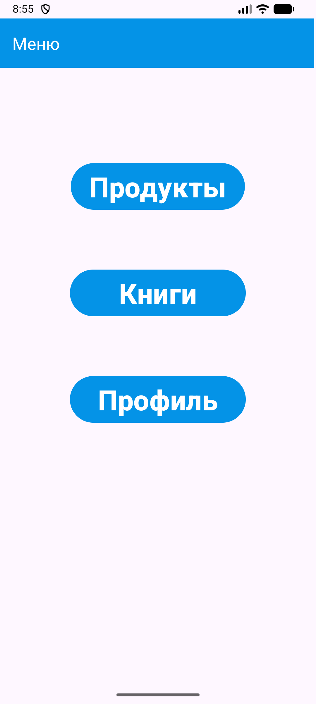
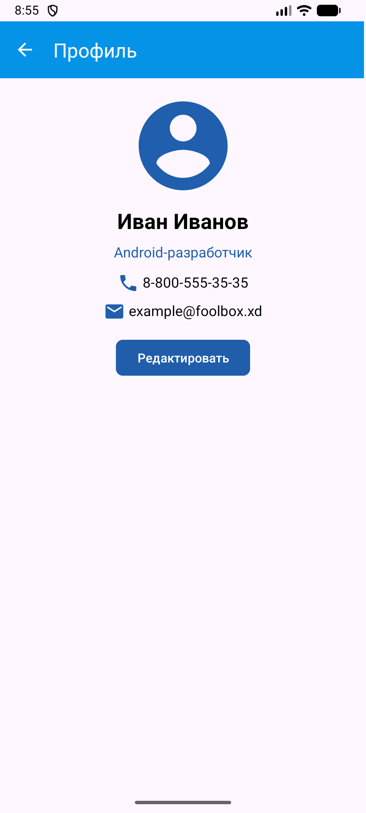

<div align="center">
МИНИСТЕРСТВО НАУКИ И ВЫСШЕГО ОБРАЗОВАНИЯ РОССИЙСКОЙ ФЕДЕРАЦИИ<br>
ФЕДЕРАЛЬНОЕ ГОСУДАРСТВЕННОЕ БЮДЖЕТНОЕ ОБРАЗОВАТЕЛЬНОЕ УЧРЕЖДЕНИЕ ВЫСШЕГО ОБРАЗОВАНИЯ<br>
«САХАЛИНСКИЙ ГОСУДАРСТВЕННЫЙ УНИВЕРСИТЕТ»
</div>


<br>
<br>

<div align="center">
Институт естественных наук и техносферной безопасности<br> 
Кафедра информатики<br>
Феофанов Артем
</div>


<br>
<br>
<br>
<br>

<div align="center">
Лабораторная работа №4<br>
«Верстка экрана профиля пользователя (аватар, имя, кнопка «Редактировать»)»<br>  
01.03.02 Прикладная математика и информатика
</div>

<br>
<br>
<br>
<br>
<br>
<br>
<br>
<br>
<br>
<br>
<br>
<br>
<br>

<div align="right">
Научный руководитель<br>
Соболев Евгений Игоревич
</div>

<br>
<br>
<br>

<div align="center">
г. Южно-Сахалинск<br>  
2026 г.
</div>

---

# Лабораторная работа №4
## Верстка экрана профиля пользователя (аватар, имя, кнопка «Редактировать»)

**Цель работы:** Освоить создание пользовательского интерфейса в Android с использованием `ConstraintLayout`, изучить основные компоненты: `ImageView`, `TextView`, `Button`. Научиться работать с ресурсами (строки, цвета, размеры) и обрабатывать нажатия кнопок.

## Листинг файлов

### Файл `ProfileActivity.kt`

Был создан файл `ProfileActivity.kt`, который хранит логику запуска активности и обработку нажатий кнопок.

```kotlin
package com.example.mynotfirstapp

import android.os.Bundle
import android.view.View
import androidx.activity.enableEdgeToEdge
import androidx.appcompat.app.AppCompatActivity
import androidx.appcompat.widget.Toolbar
import androidx.core.view.ViewCompat
import androidx.core.view.WindowInsetsCompat
import android.widget.Button
import android.widget.EditText
import android.widget.ImageView
import android.widget.TextView
import android.widget.Toast
import androidx.constraintlayout.widget.ConstraintLayout
import androidx.constraintlayout.widget.ConstraintSet
import androidx.activity.result.contract.ActivityResultContracts
import androidx.activity.result.PickVisualMediaRequest

class ProfileActivity : AppCompatActivity() {
    override fun onCreate(savedInstanceState: Bundle?) {
        super.onCreate(savedInstanceState)
        enableEdgeToEdge()
        setContentView(R.layout.activity_profile)
        ViewCompat.setOnApplyWindowInsetsListener(findViewById(R.id.main)) { v, insets ->
            val systemBars = insets.getInsets(WindowInsetsCompat.Type.systemBars())
            v.setPadding(systemBars.left, systemBars.top, systemBars.right, systemBars.bottom)
            insets
        }

        val toolbar: Toolbar = findViewById(R.id.toolbar)
        setSupportActionBar(toolbar)
        supportActionBar?.setDisplayHomeAsUpEnabled(true)


        var isEditing = false

        val btnEdit = findViewById<Button>(R.id.buttonEdit)
        val textName = findViewById<TextView>(R.id.textName)
        val editName = findViewById<EditText>(R.id.editName)
        val textStatus = findViewById<TextView>(R.id.textStatus)
        val editStatus = findViewById<EditText>(R.id.editStatus)
        val textPhone = findViewById<TextView>(R.id.textPhone)
        val textEmail = findViewById<TextView>(R.id.textEmail)
        val layout = findViewById<ConstraintLayout>(R.id.main)
        val constraintSet = ConstraintSet()

        btnEdit.setOnClickListener {
            if (!isEditing) {
                Toast.makeText(this, R.string.toast_message, Toast.LENGTH_SHORT).show()

                editName.setText(textName.text)
                editStatus.setText(textStatus.text)
                btnEdit.text = "Сохранить"

                textName.visibility = View.GONE
                textStatus.visibility = View.GONE
                //textPhone.visibility = View.GONE
                //textEmail.visibility = View.GONE
                editName.visibility = View.VISIBLE
                editStatus.visibility = View.VISIBLE

                isEditing = true
            }
            else {
                val newName = editName.text.trim()
                val newStatus = editStatus.text.trim()

                if (newName.isEmpty() || newStatus.isEmpty()) {
                    Toast.makeText(this, "Имя или статус не могут быть пустыми", Toast.LENGTH_SHORT).show()
                    return@setOnClickListener
                }

                textName.setText(newName)
                textStatus.setText(newStatus)
                btnEdit.text = "Редактировать"

                textName.visibility = View.VISIBLE
                textStatus.visibility = View.VISIBLE
                editName.visibility = View.GONE
                editStatus.visibility = View.GONE

                isEditing = false

                Toast.makeText(this, "Сохранено", Toast.LENGTH_SHORT).show()
            }

        }

        var profilePhoto = findViewById<ImageView>(R.id.imageAvatar)

        val pickPhoto = registerForActivityResult(ActivityResultContracts.PickVisualMedia()) { uri ->
            if (uri != null) {
                profilePhoto.setImageURI(uri)
            } else {
                Toast.makeText(this, "Ничего не выбрано", Toast.LENGTH_SHORT).show()
            }
        }

        profilePhoto.setOnClickListener {
            pickPhoto.launch(PickVisualMediaRequest(ActivityResultContracts.PickVisualMedia.ImageOnly))
        }
    }


    override fun onSupportNavigateUp(): Boolean {
        onBackPressed()
        return true
    }
}
```

### Файл `activity_profile.xml`

Был создан файл, который хранит в себе всю разметку активности (кнопки, `TextView`, `EditText`, `ImageView`).

```xml
<?xml version="1.0" encoding="utf-8"?>
<androidx.constraintlayout.widget.ConstraintLayout xmlns:android="http://schemas.android.com/apk/res/android"
    xmlns:app="http://schemas.android.com/apk/res-auto"
    xmlns:tools="http://schemas.android.com/tools"
    android:id="@+id/main"
    android:layout_width="match_parent"
    android:layout_height="match_parent"
    tools:context=".ProfileActivity">

    <androidx.appcompat.widget.Toolbar
        android:id="@+id/toolbar"
        android:layout_width="409dp"
        android:layout_height="wrap_content"
        android:background="?attr/colorPrimary"
        android:minHeight="?attr/actionBarSize"
        android:theme="@style/Base.Theme.MyNotFirstApp"
        app:layout_constraintStart_toStartOf="parent"
        app:layout_constraintTop_toTopOf="parent"
        app:title="@string/btn_3"
        app:titleTextColor="@color/white" />

    <ImageView
        android:id="@+id/imageAvatar"
        android:layout_width="@dimen/avatar_size"
        android:layout_height="@dimen/avatar_size"
        android:layout_marginTop="@dimen/margin_normal"
        android:contentDescription="@string/profile_name"
        android:src="@drawable/ic_profile"
        app:layout_constraintBottom_toTopOf="@+id/textName"
        app:layout_constraintLeft_toLeftOf="parent"
        app:layout_constraintRight_toRightOf="parent"
        app:layout_constraintTop_toBottomOf="@+id/toolbar" />

    <TextView
        android:id="@+id/textName"
        android:layout_width="0dp"
        android:layout_height="wrap_content"
        android:layout_marginLeft="32dp"
        android:layout_marginRight="32dp"
        android:layout_marginTop="@dimen/margin_small"
        android:gravity="center_horizontal"
        android:text="@string/profile_name"
        android:textColor="@color/black"
        android:textSize="@dimen/text_size_name"
        android:textStyle="bold"
        android:visibility="visible"
        app:layout_constraintLeft_toLeftOf="parent"
        app:layout_constraintRight_toRightOf="parent"
        app:layout_constraintTop_toBottomOf="@id/imageAvatar" />

    <EditText
        android:id="@+id/editName"
        android:layout_width="0dp"
        android:layout_height="wrap_content"
        android:layout_marginLeft="32dp"
        android:layout_marginTop="-1dp"
        android:layout_marginRight="32dp"
        android:gravity="center_horizontal"
        android:inputType="text"
        android:maxLength="26"
        android:minWidth="100dp"
        android:text="@string/profile_name"
        android:textColor="@color/black"
        android:textSize="@dimen/text_size_name"
        android:textStyle="bold"
        android:visibility="gone"
        app:layout_constraintEnd_toEndOf="parent"
        app:layout_constraintLeft_toLeftOf="parent"
        app:layout_constraintRight_toRightOf="parent"
        app:layout_constraintStart_toStartOf="parent"
        app:layout_constraintTop_toBottomOf="@id/imageAvatar" />

    <TextView
        android:id="@+id/textStatus"
        android:layout_width="0dp"
        android:layout_marginLeft="16dp"
        android:layout_marginRight="16dp"
        android:layout_height="wrap_content"
        android:layout_marginTop="@dimen/margin_small"
        android:gravity="center_horizontal"
        android:text="@string/profile_status"
        android:textColor="#205EAC"
        android:textSize="@dimen/text_size_status"
        android:visibility="visible"
        app:layout_constraintLeft_toLeftOf="parent"
        app:layout_constraintRight_toRightOf="parent"
        app:layout_constraintTop_toBottomOf="@id/textName" />

    <EditText
        android:id="@+id/editStatus"
        android:layout_width="0dp"
        android:layout_height="wrap_content"
        android:layout_marginLeft="16dp"
        android:layout_marginTop="-12dp"
        android:layout_marginRight="16dp"
        android:gravity="center_horizontal"
        android:maxLength="200"
        android:minWidth="100dp"
        android:text="@string/profile_status"
        android:textColor="#205EAC"
        android:textSize="@dimen/text_size_status"
        android:visibility="gone"
        app:layout_constraintLeft_toLeftOf="parent"
        app:layout_constraintRight_toRightOf="parent"
        app:layout_constraintTop_toBottomOf="@id/editName" />

    <androidx.constraintlayout.widget.Barrier
        android:id="@+id/barrierStatus"
        android:layout_width="wrap_content"
        android:layout_height="wrap_content"
        app:barrierDirection="bottom"
        app:constraint_referenced_ids="textStatus,editStatus" />

    <TextView
        android:id="@+id/textPhone"
        android:layout_width="wrap_content"
        android:layout_height="wrap_content"
        android:layout_marginTop="12dp"
        android:text="@string/profile_phone"
        android:textColor="@color/black"
        android:drawableStart="@drawable/ic_phone"
        android:drawablePadding="4dp"
        android:textSize="@dimen/text_size_status"
        app:layout_constraintLeft_toLeftOf="parent"
        app:layout_constraintRight_toRightOf="parent"
        app:layout_constraintTop_toBottomOf="@id/barrierStatus" />

    <TextView
        android:id="@+id/textEmail"
        android:layout_width="wrap_content"
        android:layout_height="wrap_content"
        android:layout_marginTop="@dimen/margin_small"
        android:text="@string/profile_email"
        android:drawableStart="@drawable/ic_email"
        android:drawablePadding="4dp"
        android:textColor="@color/black"
        android:textSize="@dimen/text_size_status"
        app:layout_constraintLeft_toLeftOf="parent"
        app:layout_constraintRight_toRightOf="parent"
        app:layout_constraintTop_toBottomOf="@id/textPhone" />

    <Button
        android:id="@+id/buttonEdit"
        android:layout_width="wrap_content"
        android:layout_height="wrap_content"
        android:layout_marginTop="@dimen/margin_normal"
        android:backgroundTint="#205EAC"
        android:text="@string/button_edit"
        app:cornerRadius="@dimen/button_corner_radius"
        app:layout_constraintLeft_toLeftOf="parent"
        app:layout_constraintRight_toRightOf="parent"
        app:layout_constraintTop_toBottomOf="@id/textEmail" />

</androidx.constraintlayout.widget.ConstraintLayout>
```

## Скриншоты работающего приложения

### Главное меню (`MainActivity`)



### Окно "Профиль" (`ProfileActivity`)



## Контрольные вопросы

1. `ConstraintLayout` – это гибкий и мощный менеджер расположения, который позволяет создавать плоские иерархии представлений. Он используется по умолчанию в шаблонах Android Studio. `LinearLayout` часто требует вложения (`LinearLayout` внутри `LinearLayout`) для создания сложного дизайна и умеет выравнивать элементы только по одной оси. `ConstraintLayout` позволяет привязать, например, верхний край кнопки к нижнему краю картинки, а центр кнопки — к правому краю экрана одновременно.

2. Атрибуты `app:layout_constraint...` нужны для определения позиции элементов через связи относительно родителя или других элементов.

3. Чтобы вынести размеры и цвета в ресурсы нужно создать файлы `res/values/colors.xml` и `res/values/dimens.xml`. Это нужно для единого доступа к изменению внешнего вида всего приложения и облегчения его поддержки.

4. Нужно "повесить" на кнопку обработчик клика:

```kotlin
val buttonEdit = findViewById<Button>(R.id.buttonEdit)

buttonEdit.setOnClickListener {
    Toast.makeText(this, R.string.toast_message, Toast.LENGTH_SHORT).show()
}
```

5. Аналогично с прошлым:

```kotlin
var profilePhoto = findViewById<ImageView>(R.id.imageAvatar)

profilePhoto.setOnClickListener {
    pickPhoto.launch(PickVisualMediaRequest(ActivityResultContracts.PickVisualMedia.ImageOnly))
}
```

## Вывод
В ходе выполнения лабораторной работы была достигнута поставленная цель: изучены основы `ConstraintLayout`, рассмотрены и использованы компоненты `ImageView`, `TextView`, `Button`. Продемонстрирован навык вынесения констант (строк, размеров и цветов) в соответствующие ресурсные файлы (`strings.xml`, `dimens.xml`). Реализован механизм переключения между режимами просмотра и редактирования данных в приложении.