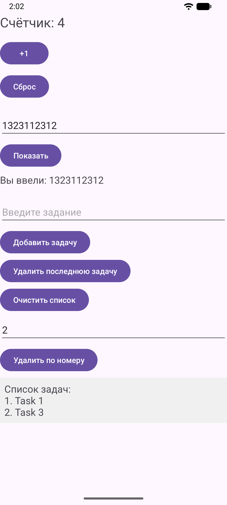
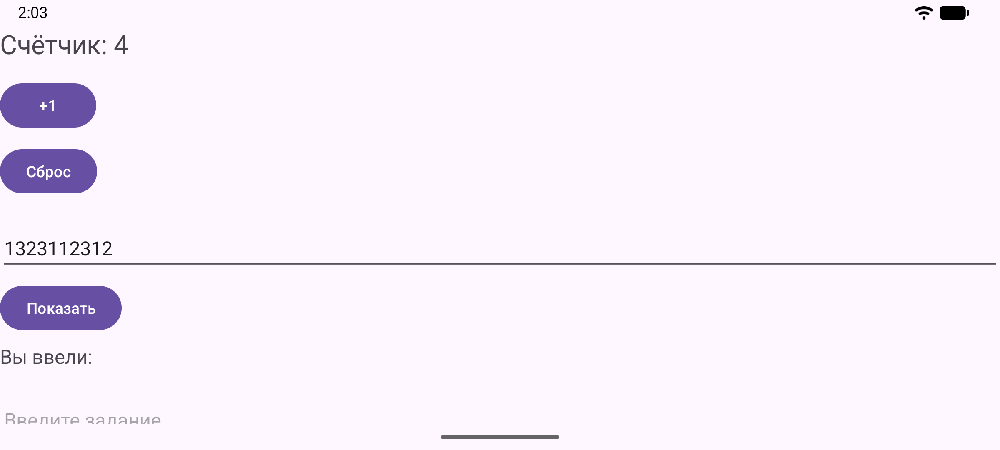
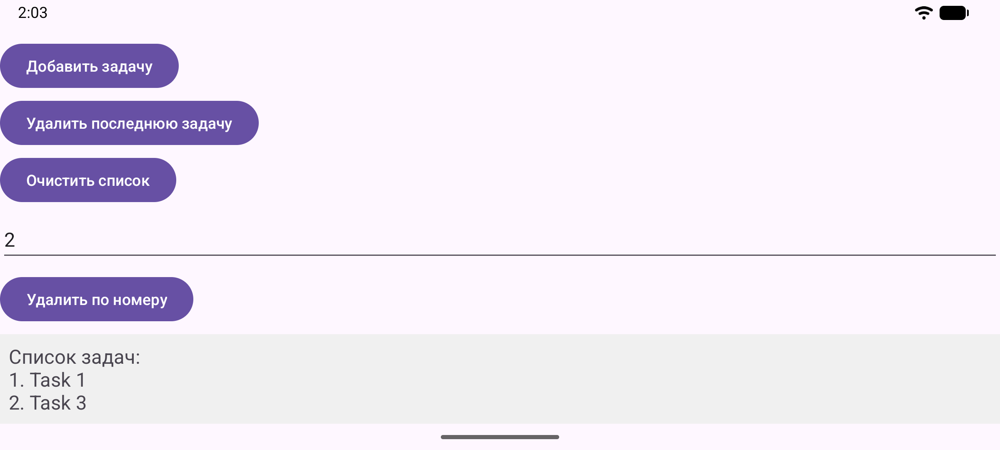

<div align="center">
МИНИСТЕРСТВО НАУКИ И ВЫСШЕГО ОБРАЗОВАНИЯ РОССИЙСКОЙ ФЕДЕРАЦИИ<br>
ФЕДЕРАЛЬНОЕ ГОСУДАРСТВЕННОЕ БЮДЖЕТНОЕ ОБРАЗОВАТЕЛЬНОЕ УЧРЕЖДЕНИЕ ВЫСШЕГО ОБРАЗОВАНИЯ<br>
«САХАЛИНСКИЙ ГОСУДАРСТВЕННЫЙ УНИВЕРСИТЕТ»
</div>


<br>
<br>

<div align="center">
Институт естественных наук и техносферной безопасности<br> 
Кафедра информатики<br>
Феофанов Артем
</div>


<br>
<br>
<br>
<br>

<div align="center">
Лабораторная работа №5<br>
«Счетчик нажатий, поле ввода и отображение текста. Реализация ToDo-списка»<br>  
01.03.02 Прикладная математика и информатика
</div>

<br>
<br>
<br>
<br>
<br>
<br>
<br>
<br>
<br>
<br>
<br>
<br>
<br>

<div align="right">
Научный руководитель<br>
Соболев Евгений Игоревич
</div>

<br>
<br>
<br>

<div align="center">
г. Южно-Сахалинск<br>  
2026 г.
</div>

---

# Лабораторная работа №5
## Счетчик нажатий, поле ввода и отображение текста. Реализация ToDo-списка

**Цель работы:** Научиться обрабатывать пользовательский ввод, работать с состоянием (счетчик, список задач), динамически обновлять интерфейс приложения на Kotlin.

## Листинг файлов

### Файл `activity_main.xml`

Был создан файл, который хранит в себе всю разметку активности (кнопки (сброс счетчика, удаление последней задачи, удаление всех задач, удаление по номеру задачи), поля для ввода).

```xml
<?xml version="1.0" encoding="utf-8"?>
<LinearLayout
    xmlns:android="http://schemas.android.com/apk/res/android"
    android:id="@+id/main"
    android:layout_width="match_parent"
    android:layout_height="match_parent"
    android:orientation="vertical"
    android:padding="16dp">

    <ScrollView
        android:layout_width="match_parent"
        android:layout_height="match_parent"
        android:scrollbars="vertical">

        <LinearLayout
            android:layout_width="match_parent"
            android:layout_height="wrap_content"
            android:orientation="vertical" >
            <!-- Блок 1: Счётчик -->

            <TextView
                android:id="@+id/textCounter"
                android:layout_width="wrap_content"
                android:layout_height="wrap_content"
                android:text="@string/counter_text"
                android:textSize="24sp"
                android:layout_marginBottom="16dp"/>

            <Button
                android:id="@+id/buttonIncrement"
                android:layout_width="wrap_content"
                android:layout_height="wrap_content"
                android:text="@string/button_increment"
                android:layout_marginBottom="12dp"/>

            <Button
                android:id="@+id/buttonReset"
                android:layout_width="wrap_content"
                android:layout_height="wrap_content"
                android:text="@string/button_reset"
                android:layout_marginBottom="24dp"/>

            <!-- Блок 2: Поле ввода и отображение текста -->

            <EditText
                android:id="@+id/editTextInput"
                android:layout_width="match_parent"
                android:layout_height="wrap_content"
                android:hint="@string/hint_input"
                android:inputType="text"
                android:layout_marginBottom="8dp"/>

            <Button
                android:id="@+id/buttonShow"
                android:layout_width="wrap_content"
                android:layout_height="wrap_content"
                android:text="@string/button_show"
                android:layout_marginBottom="8dp"/>

            <TextView
                android:id="@+id/textEntered"
                android:layout_width="wrap_content"
                android:layout_height="wrap_content"
                android:text="@string/label_entered"
                android:textSize="18sp"
                android:layout_marginBottom="24dp"/>

            <!-- Блок 3: ToDo список -->

            <EditText
                android:id="@+id/editTextTask"
                android:layout_width="match_parent"
                android:layout_height="wrap_content"
                android:hint="@string/hint_input_task"
                android:inputType="text"
                android:layout_marginBottom="8dp"/>

            <Button
                android:id="@+id/buttonAddTask"
                android:layout_width="wrap_content"
                android:layout_height="wrap_content"
                android:text="@string/button_add_task"
                android:layout_marginBottom="4dp"/>

            <Button
                android:id="@+id/buttonDelLastTask"
                android:layout_width="wrap_content"
                android:layout_height="wrap_content"
                android:layout_marginBottom="4dp"
                android:text="@string/button_del_last_task" />

            <Button
                android:id="@+id/buttonDelTasks"
                android:layout_width="wrap_content"
                android:layout_height="wrap_content"
                android:layout_marginBottom="8dp"
                android:text="@string/button_del_tasks" />

            <EditText
                android:id="@+id/editTextTaskId"
                android:layout_width="match_parent"
                android:layout_height="wrap_content"
                android:layout_marginBottom="8dp"
                android:hint="@string/hint_input_task_id"
                android:inputType="number" />

            <Button
                android:id="@+id/buttonDelTaskById"
                android:layout_width="wrap_content"
                android:layout_height="wrap_content"
                android:layout_marginBottom="8dp"
                android:text="@string/button_del_task_by_id" />

            <TextView
                android:id="@+id/textTasks"
                android:layout_width="match_parent"
                android:layout_height="wrap_content"
                android:background="#F0F0F0"
                android:padding="8dp"
                android:text="@string/label_tasks"
                android:textSize="18sp" />

        </LinearLayout>
    </ScrollView>

</LinearLayout>
```

### Файл `MainActivity.kt`

Был создан файл, который всю логику приложения (сохранение состояния при повороте экрана, удаление по номеру, удаление всех задач, сброс счетчика)

```kotlin
package com.example.todoapp

import android.os.Bundle
import androidx.activity.enableEdgeToEdge
import androidx.appcompat.app.AppCompatActivity
import androidx.core.view.ViewCompat
import androidx.core.view.WindowInsetsCompat
import android.widget.TextView
import android.widget.Button
import android.widget.EditText
import android.widget.Toast

class MainActivity : AppCompatActivity() {
    private var counter = 0
    private val tasks = mutableListOf<String>()

    override fun onCreate(savedInstanceState: Bundle?) {
        super.onCreate(savedInstanceState)
        enableEdgeToEdge()
        setContentView(R.layout.activity_main)
        ViewCompat.setOnApplyWindowInsetsListener(findViewById(R.id.main)) { v, insets ->
            val systemBars = insets.getInsets(WindowInsetsCompat.Type.systemBars())
            v.setPadding(systemBars.left, systemBars.top, systemBars.right, systemBars.bottom)
            insets
        }

        val textCounter = findViewById<TextView>(R.id.textCounter)
        val buttonIncrement = findViewById<Button>(R.id.buttonIncrement)
        val buttonReset = findViewById<Button>(R.id.buttonReset)

        updateCounterDisplay(textCounter)

        buttonIncrement.setOnClickListener {
            counter++
            updateCounterDisplay(textCounter)
        }

        buttonReset.setOnClickListener {
            counter = 0
            updateCounterDisplay(textCounter)
        }

        val editTextInput = findViewById<EditText>(R.id.editTextInput)
        val buttonShow = findViewById<Button>(R.id.buttonShow)
        val textEntered = findViewById<TextView>(R.id.textEntered)

        buttonShow.setOnClickListener {
            val inputText = editTextInput.text.toString()
            textEntered.text = getString(R.string.label_entered) + " $inputText"
        }

        val editTextTask = findViewById<EditText>(R.id.editTextTask)
        val buttonAddTask = findViewById<Button>(R.id.buttonAddTask)
        val buttonDelLastTask = findViewById<Button>(R.id.buttonDelLastTask)
        val buttonDelTasks = findViewById<Button>(R.id.buttonDelTasks)
        val textTasks = findViewById<TextView>(R.id.textTasks)

        buttonAddTask.setOnClickListener {
            val task = editTextTask.text.toString()
            if (task.isNotBlank()) {
                tasks.add(task)
                updateTasksDisplay(tasks, textTasks)
                editTextTask.text.clear() // очищаем поле ввода
            } else {
                Toast.makeText(this, "Введите задачу", Toast.LENGTH_SHORT).show()
            }
        }

        buttonDelLastTask.setOnClickListener {
            if (!tasks.isEmpty()) {
                tasks.removeAt(tasks.lastIndex)
                updateTasksDisplay(tasks, textTasks)
                editTextTask.text.clear()
            } else {
                Toast.makeText(this, "Список задач пуст", Toast.LENGTH_SHORT).show()
            }
        }

        buttonDelTasks.setOnClickListener {
            if (!tasks.isEmpty()) {
                tasks.clear()
                updateTasksDisplay(tasks, textTasks)
                editTextTask.text.clear()
            } else {
                Toast.makeText(this, "Список задач пуст", Toast.LENGTH_SHORT).show()
            }
        }

        val textTaskId = findViewById<EditText>(R.id.editTextTaskId)
        val buttonDelTaskById = findViewById<Button>(R.id.buttonDelTaskById)

        buttonDelTaskById.setOnClickListener {
            val id = textTaskId.text.toString().toIntOrNull()

            if (id != null) {
                if (!tasks.isEmpty()) {
                    if ((id - 1) >= 0 && (id - 1) < tasks.size) {
                        tasks.removeAt(id - 1)
                        updateTasksDisplay(tasks, textTasks)
                        editTextTask.text.clear()
                    } else {
                        Toast.makeText(this, "Такой номер задачи не существует", Toast.LENGTH_SHORT).show()
                    }
                } else {
                    Toast.makeText(this, "Список задач пуст", Toast.LENGTH_SHORT).show()
                }
            } else {
                Toast.makeText(this, "Номер должен быть целым числом", Toast.LENGTH_SHORT).show()
            }
        }

    }

    override fun onSaveInstanceState(outState: Bundle) {
        super.onSaveInstanceState(outState)
        outState.putInt("counter", counter)
        outState.putStringArrayList("tasks", ArrayList(tasks))
    }

    override fun onRestoreInstanceState(savedInstanceState: Bundle) {
        super.onRestoreInstanceState(savedInstanceState)
        counter = savedInstanceState.getInt("counter")
        tasks.clear()
        tasks.addAll(savedInstanceState.getStringArrayList("tasks") ?: emptyList())
        updateCounterDisplay(findViewById(R.id.textCounter))
        updateTasksDisplay(tasks, findViewById(R.id.textTasks))
    }

    private fun updateCounterDisplay(textView: TextView) {
        textView.text = getString(R.string.counter_text, counter)
    }

    private fun updateTasksDisplay(tasks: MutableList<String>, textTasks: TextView) {
        if (tasks.isEmpty()) {
            textTasks.text = getString(R.string.label_tasks)
        } else {
            textTasks.text = "Список задач:\n" + tasks.withIndex().joinToString("\n") { (index, task) -> "${index + 1}. $task" }
        }
    }
}
```

## Скриншоты работающего приложения

### Основная активность (`MainActivity`)



### Сохранение данных после смены ориентации экрана (`MainActivity`)




## Контрольные вопросы

1. Чтобы получить текст из `EditText` нужно:
    - Найти `EditText` в активности или фрагменте и получить текст через метод `ToString()`:
```kotlin
val editTextTask = findViewById<EditText>(R.id.editTextTask)
val task = editTextTask.text.toString()
```

2. Когда мы поворачиваете экран, происходит изменение конфигурации. По умолчанию Android полностью уничтожает текущий экземпляр `Activity` и создает его заново. Для сохранения данных можно использовать `onSaveInstanceState` или `ViewModel`.

3. В `Kotlin` метод `joinToString` используется для превращения коллекции в одну строку. По умолчанию `joinToString `разделяет элементы запятой с пробелом `(, )`. Чтобы использовать свой разделитель нужно передать его в качестве параметра:
```kotlin
tasks.joinToString("\n")
```

4. Основная разница между `List` и `MutableList` заключается в возможности изменения содержимого: `List` - это неизменяемый список, создаваемый через listOf(), из которого можно только читать данные. `MutableList` - это изменяемый список, создаваемый через mutableListOf(), позволяющий добавлять, удалять и обновлять элементы (с помощью `add`, `remove`, `set`). 

5. Чтобы очистить поле ввода после добавления задачи, нужно:
    - Найти `EditText` в активности или фрагменте и очистить поле ввода через метод `clear`:
```kotlin
val editTextTask = findViewById<EditText>(R.id.editTextTask)
editTextTask.text.clear()
```

## Вывод
В ходе выполнения лабораторной работы была достигнуты следующие итоги:  
1. Реализовано динамическое обновление интерфейса при изменении данных (счётчика и списка задач). 
2. Попрактиковался в работе с коллекциями `MutableList` и методами преобразования данных, такими как `joinToString` с использованием лямбда-выражений для форматирования вывода.
3. На практике столкнулся с проблемой потери данных при повороте экрана и изучил способы её решения с помощью механизма `onSaveInstanceState`.
4. Реализовал базовые проверки (метод `isNotBlank()` и `toIntOrNull()`), что позволило сделать приложение более устойчивым к некорректным действиям пользователя.