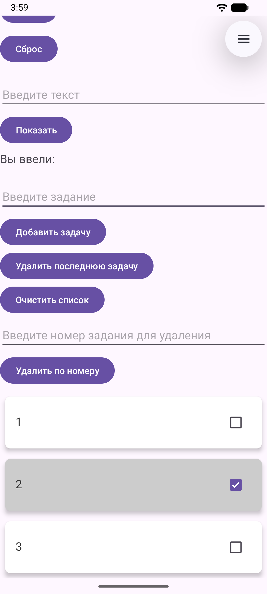

<div align="center">
МИНИСТЕРСТВО НАУКИ И ВЫСШЕГО ОБРАЗОВАНИЯ РОССИЙСКОЙ ФЕДЕРАЦИИ<br>
ФЕДЕРАЛЬНОЕ ГОСУДАРСТВЕННОЕ БЮДЖЕТНОЕ ОБРАЗОВАТЕЛЬНОЕ УЧРЕЖДЕНИЕ ВЫСШЕГО ОБРАЗОВАНИЯ<br>
«САХАЛИНСКИЙ ГОСУДАРСТВЕННЫЙ УНИВЕРСИТЕТ»
</div>


<br>
<br>

<div align="center">
Институт естественных наук и техносферной безопасности<br> 
Кафедра информатики<br>
Феофанов Артем
</div>


<br>
<br>
<br>
<br>

<div align="center">
Лабораторная работа №6<br>
«Отображение списка задач из предыдущей лабораторной в красивых карточках»<br>  
01.03.02 Прикладная математика и информатика
</div>

<br>
<br>
<br>
<br>
<br>
<br>
<br>
<br>
<br>
<br>
<br>
<br>
<br>

<div align="right">
Научный руководитель<br>
Соболев Евгений Игоревич
</div>

<br>
<br>
<br>

<div align="center">
г. Южно-Сахалинск<br>  
2026 г.
</div>

---

# Лабораторная работа №6
## Отображение списка задач из предыдущей лабораторной в красивых карточках

**Цель работы:** Научиться использовать `RecyclerView` для отображения списка данных, освоить создание адаптера и `ViewHolder`, применить `CardView` для оформления элементов списка.

## Листинг файлов

### Файл `item_task.xml`

Был создан файл разметки `item_task.xml` в папке `res/layout`, который описывает как выглядит карточка задачи.

```xml
<?xml version="1.0" encoding="utf-8"?>
<androidx.cardview.widget.CardView
    xmlns:android="http://schemas.android.com/apk/res/android"
    xmlns:app="http://schemas.android.com/apk/res-auto"
    android:layout_width="match_parent"
    android:layout_height="wrap_content"
    android:layout_margin="8dp"
    app:cardCornerRadius="8dp"
    app:cardElevation="4dp"
    app:cardBackgroundColor="#FFFFFF">

    <LinearLayout
        android:layout_width="match_parent"
        android:layout_height="wrap_content"
        android:orientation="horizontal"
        android:padding="16dp">

        <TextView
            android:id="@+id/textTask"
            android:layout_width="0dp"
            android:layout_height="wrap_content"
            android:layout_weight="1"
            android:textSize="18sp"
            android:textColor="#333333"/>

        <CheckBox
            android:id="@+id/checkTask"
            android:layout_width="wrap_content"
            android:layout_height="wrap_content"/>

    </LinearLayout>

</androidx.cardview.widget.CardView>
```

### Файл `TaskAdapter.kt`

Был создан файл адаптера, который содержит всю логику создания карточек задач.

```kotlin
package com.example.todoapp

import android.graphics.Color
import android.view.LayoutInflater
import android.view.View
import android.view.ViewGroup
import android.widget.CheckBox
import android.widget.EditText
import android.widget.TextView
import androidx.cardview.widget.CardView
import androidx.recyclerview.widget.RecyclerView
import android.app.AlertDialog
import android.content.Context

class TaskAdapter(private val tasks: MutableList<String>, private val isChecked: MutableList<Int>, private val onItemLongClick: (Int) -> Unit) :
    RecyclerView.Adapter<TaskAdapter.TaskViewHolder>() {

    // ViewHolder хранит ссылки на элементы внутри карточки
    class TaskViewHolder(itemView: View) : RecyclerView.ViewHolder(itemView) {
        val textTask: TextView = itemView.findViewById(R.id.textTask)
        val checkTask: CheckBox = itemView.findViewById(R.id.checkTask)
    }

    override fun onCreateViewHolder(parent: ViewGroup, viewType: Int): TaskViewHolder {
        val view = LayoutInflater.from(parent.context)
            .inflate(R.layout.item_task, parent, false)
        return TaskViewHolder(view)
    }

    override fun onBindViewHolder(holder: TaskViewHolder, position: Int) {
        val task = tasks[position]
        val check = isChecked[position]
        holder.textTask.text = task
        holder.checkTask.isChecked = check != 0
        val color = if (position % 2 == 0) Color.WHITE else Color.LTGRAY
        (holder.itemView as? CardView)?.setCardBackgroundColor(color)

        // Обработка чекбокса (опционально)
        holder.checkTask.setOnCheckedChangeListener { _, isChecked ->
            // Можно добавить логику отметки выполнения, например, перечеркивание текста
            if (isChecked) {
                holder.textTask.paintFlags = holder.textTask.paintFlags or android.graphics.Paint.STRIKE_THRU_TEXT_FLAG
            } else {
                holder.textTask.paintFlags = holder.textTask.paintFlags and android.graphics.Paint.STRIKE_THRU_TEXT_FLAG.inv()
            }
        }

        holder.itemView.setOnLongClickListener {
            onItemLongClick(position)
            true
        }
    }

    override fun getItemCount(): Int = tasks.size

    // Метод для обновления списка
    fun updateData(newTasks: List<String>) {
        tasks.clear()
        tasks.addAll(newTasks)
        notifyDataSetChanged()
    }
}
```

### Файл `MainActivity.kt`

Был создан файл, который всю логику приложения (сохранение состояния при повороте экрана, удаление по номеру, удаление всех задач, сброс счетчика).

```kotlin
package com.example.todoapp

import android.app.AlertDialog
import android.os.Bundle
import androidx.activity.enableEdgeToEdge
import androidx.appcompat.app.AppCompatActivity
import androidx.core.view.ViewCompat
import androidx.core.view.WindowInsetsCompat
import android.widget.TextView
import android.widget.Button
import android.widget.EditText
import android.widget.Toast
import androidx.recyclerview.widget.LinearLayoutManager
import androidx.recyclerview.widget.RecyclerView
import androidx.recyclerview.widget.ItemTouchHelper

class MainActivity : AppCompatActivity() {
    private var counter = 0
    private val tasks = mutableListOf<String>()
    private val isChecked = mutableListOf<Int>()
    private lateinit var adapter: TaskAdapter

    override fun onCreate(savedInstanceState: Bundle?) {
        super.onCreate(savedInstanceState)
        enableEdgeToEdge()
        setContentView(R.layout.activity_main)
        ViewCompat.setOnApplyWindowInsetsListener(findViewById(R.id.main)) { v, insets ->
            val systemBars = insets.getInsets(WindowInsetsCompat.Type.systemBars())
            v.setPadding(systemBars.left, systemBars.top, systemBars.right, systemBars.bottom)
            insets
        }

        val textCounter = findViewById<TextView>(R.id.textCounter)
        val buttonIncrement = findViewById<Button>(R.id.buttonIncrement)
        val buttonReset = findViewById<Button>(R.id.buttonReset)

        updateCounterDisplay(textCounter)

        buttonIncrement.setOnClickListener {
            counter++
            updateCounterDisplay(textCounter)
        }

        buttonReset.setOnClickListener {
            counter = 0
            updateCounterDisplay(textCounter)
        }

        val editTextInput = findViewById<EditText>(R.id.editTextInput)
        val buttonShow = findViewById<Button>(R.id.buttonShow)
        val textEntered = findViewById<TextView>(R.id.textEntered)

        buttonShow.setOnClickListener {
            val inputText = editTextInput.text.toString()
            textEntered.text = getString(R.string.label_entered) + " $inputText"
        }

        val editTextTask = findViewById<EditText>(R.id.editTextTask)
        val buttonAddTask = findViewById<Button>(R.id.buttonAddTask)
        val buttonDelLastTask = findViewById<Button>(R.id.buttonDelLastTask)
        val buttonDelTasks = findViewById<Button>(R.id.buttonDelTasks)
        val recyclerView = findViewById<RecyclerView>(R.id.recyclerViewTasks)

        recyclerView.layoutManager = LinearLayoutManager(this)
        adapter = TaskAdapter(tasks, isChecked) { position ->
            showEditDialog(position)
        }
        recyclerView.adapter = adapter

        val swipeHandler = object : ItemTouchHelper.SimpleCallback(0, ItemTouchHelper.LEFT) {
            override fun onMove(
                rv: RecyclerView, vh: RecyclerView.ViewHolder, target: RecyclerView.ViewHolder
            ): Boolean = false

            override fun onSwiped(viewHolder: RecyclerView.ViewHolder, direction: Int) {
                val position = viewHolder.adapterPosition

                tasks.removeAt(position)
                isChecked.removeAt(position)
                adapter.notifyItemRemoved(position)
                adapter.notifyItemRangeChanged(position, tasks.size)
            }
        }

        val itemTouchHelper = ItemTouchHelper(swipeHandler)
        itemTouchHelper.attachToRecyclerView(recyclerView)

        buttonAddTask.setOnClickListener {
            val task = editTextTask.text.toString()
            if (task.isNotBlank()) {
                tasks.add(task)
                isChecked.add(0)
                adapter.notifyItemInserted(tasks.size - 1)
                editTextTask.text.clear()
            } else {
                Toast.makeText(this, "Введите задачу", Toast.LENGTH_SHORT).show()
            }
        }

        buttonDelLastTask.setOnClickListener {
            if (!tasks.isEmpty()) {
                tasks.removeAt(tasks.lastIndex)
                isChecked.removeAt(isChecked.lastIndex)
                adapter.notifyItemRemoved(tasks.size)
                editTextTask.text.clear()
            } else {
                Toast.makeText(this, "Список задач пуст", Toast.LENGTH_SHORT).show()
            }
        }

        buttonDelTasks.setOnClickListener {
            if (!tasks.isEmpty()) {
                tasks.clear()
                isChecked.clear()
                adapter.notifyDataSetChanged()
                editTextTask.text.clear()
            } else {
                Toast.makeText(this, "Список задач пуст", Toast.LENGTH_SHORT).show()
            }
        }

        val textTaskId = findViewById<EditText>(R.id.editTextTaskId)
        val buttonDelTaskById = findViewById<Button>(R.id.buttonDelTaskById)

        buttonDelTaskById.setOnClickListener {
            val id = textTaskId.text.toString().toIntOrNull()

            if (id != null) {
                if (!tasks.isEmpty()) {
                    if ((id - 1) >= 0 && (id - 1) < tasks.size) {
                        tasks.removeAt(id - 1)
                        isChecked.removeAt(id - 1)
                        adapter.notifyItemRemoved(id - 1)
                        adapter.notifyItemRangeChanged(id - 1, tasks.size - id - 1)
                        editTextTask.text.clear()
                    } else {
                        Toast.makeText(this, "Такой номер задачи не существует", Toast.LENGTH_SHORT).show()
                    }
                } else {
                    Toast.makeText(this, "Список задач пуст", Toast.LENGTH_SHORT).show()
                }
            } else {
                Toast.makeText(this, "Номер должен быть целым числом", Toast.LENGTH_SHORT).show()
            }
        }

        if (savedInstanceState != null) {
            val savedTasks = savedInstanceState.getStringArrayList("tasks")
            if (savedTasks != null) {
                tasks.clear()
                tasks.addAll(savedTasks)
                adapter.notifyDataSetChanged()
            }

            val savedChecks = savedInstanceState.getIntegerArrayList("isChecked")
            if (savedChecks != null) {
                isChecked.clear()
                isChecked.addAll(savedChecks)
                adapter.notifyDataSetChanged()
            }
        }
    }

    override fun onSaveInstanceState(outState: Bundle) {
        super.onSaveInstanceState(outState)
        outState.putInt("counter", counter)
        outState.putStringArrayList("tasks", ArrayList(tasks))
        outState.putIntegerArrayList("isChecked", ArrayList(isChecked))
    }

    override fun onRestoreInstanceState(savedInstanceState: Bundle) {
        super.onRestoreInstanceState(savedInstanceState)
        counter = savedInstanceState.getInt("counter")
        tasks.clear()
        tasks.addAll(savedInstanceState.getStringArrayList("tasks") ?: emptyList())
        isChecked.clear()
        isChecked.addAll(savedInstanceState.getIntegerArrayList("isChecked") ?: emptyList())
        updateCounterDisplay(findViewById(R.id.textCounter))
        adapter.notifyDataSetChanged()
    }

    private fun updateCounterDisplay(textView: TextView) {
        textView.text = getString(R.string.counter_text, counter)
    }

    private fun updateTasksDisplay(tasks: MutableList<String>, textTasks: TextView) {
        if (tasks.isEmpty()) {
            textTasks.text = getString(R.string.label_tasks)
        } else {
            textTasks.text = "Список задач:\n" + tasks.withIndex().joinToString("\n") { (index, task) -> "${index + 1}. $task" }
        }
    }

    fun showEditDialog(position: Int) {
        val task = tasks[position]
        val editText = EditText(this)
        editText.setText(task)

        AlertDialog.Builder(this)
            .setTitle("Редактировать задачу")
            .setView(editText)
            .setPositiveButton("Сохранить") { _, _ ->
                val newTitle = editText.text.toString()
                if (newTitle.isNotEmpty()) {
                    tasks[position] = newTitle
                    adapter.notifyItemChanged(position)
                }
            }
            .setNegativeButton("Отмена", null)
            .show()
    }
}
```

## Скриншоты работающего приложения



## Контрольные вопросы

1. `RecyclerView` — это современный, высокопроизводительный компонент Android для отображения больших списков данных, который перерабатывает (повторно использует) представления элементов при прокрутке. Он эффективнее, чем `ListView`, благодаря обязательному использованию шаблона `ViewHolder`, удобной кастомизации макетов (`LayoutManager`) и встроенной поддержке

2. Для работы `RecyclerView` необходимы четыре основных компонента: сам виджет в разметке, `Adapter` для связывания данных, `ViewHolder` для хранения представлений элементов и `LayoutManager` для позиционирования элементов.

3. `ViewHolder` — это вспомогательный класс в Android, который кэширует ссылки на представления (`View`) внутри элементов списка. Он устраняет необходимость вызывать `findViewById()` при каждой отрисовке элемента, что значительно повышает производительность прокрутки за счет снижения нагрузки на процессор.

4. `notifyDataSetChanged()` — это «тяжелый» метод, обновляющий весь список, перерисовывая все элементы и не дающий анимаций. `notifyItemInserted()` — «легкий» метод, указывающий конкретную позицию нового элемента, обеспечивая плавную анимацию добавления и оптимальную производительность без перерисовки всего списка.

5. Добавление кликов в `RecyclerView` обычно реализуется через `listener` в адаптере. Основной способ: создать интерфейс `OnItemClickListener` в адаптере, передать его в конструктор, и установить `setOnClickListener` внутри `onBindViewHolder` для обработки нажатий на элементы.
```kotlin
class TaskAdapter(private val tasks: MutableList<String>, private val isChecked: MutableList<Int>, private val onItemLongClick: (Int) -> Unit) :
    RecyclerView.Adapter<TaskAdapter.TaskViewHolder>() {
        /// ... ///
        override fun onBindViewHolder(holder: TaskViewHolder, position: Int) {
            /// ... ///
            holder.itemView.setOnLongClickListener {
                onItemLongClick(position)
                true
            }
        }
}
```

```kotlin
adapter = TaskAdapter(tasks, isChecked) { position ->
    showEditDialog(position)
}
```

## Вывод
В ходе выполнения лабораторной работы я освоил принципы работы с современным компонентом `RecyclerView` для отображения динамических списков в Android. Мною был реализован собственный адаптер (`TaskAdapter`), что позволило эффективно связывать данные с графическим интерфейсом. Также я научился использовать `CardView` для стилизации элементов списка, создав визуально привлекательный интерфейс карточек. Дополнительно была реализована логика взаимодействия с элементами (обработка чекбоксов, удаление и редактирование задач).