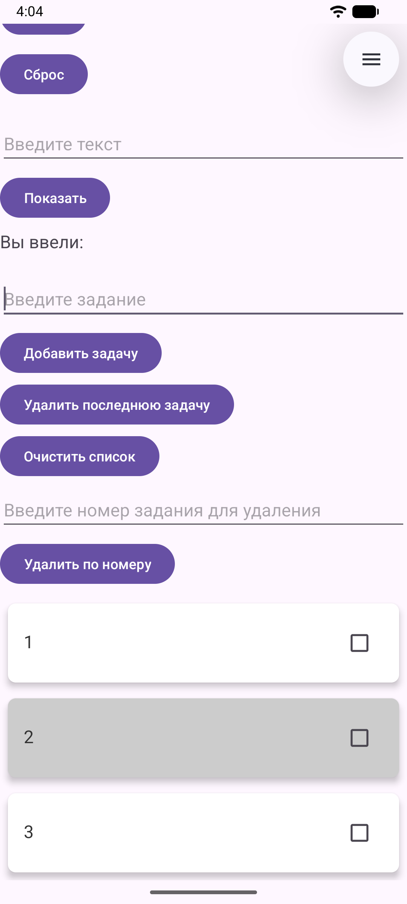
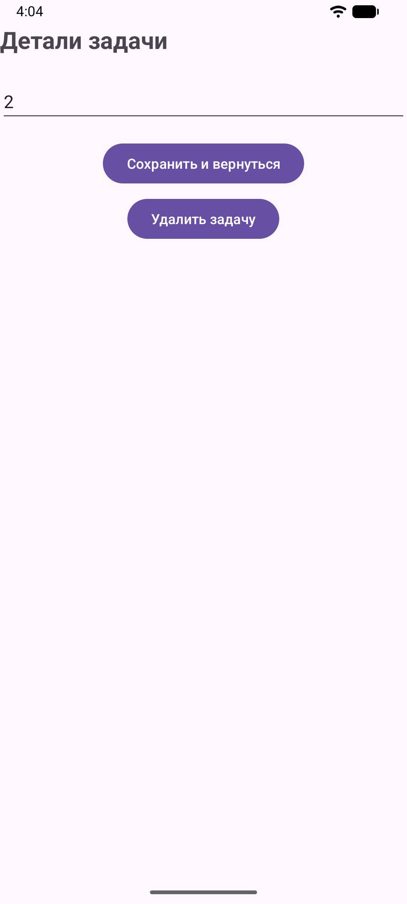

<div align="center">
МИНИСТЕРСТВО НАУКИ И ВЫСШЕГО ОБРАЗОВАНИЯ РОССИЙСКОЙ ФЕДЕРАЦИИ<br>
ФЕДЕРАЛЬНОЕ ГОСУДАРСТВЕННОЕ БЮДЖЕТНОЕ ОБРАЗОВАТЕЛЬНОЕ УЧРЕЖДЕНИЕ ВЫСШЕГО ОБРАЗОВАНИЯ<br>
«САХАЛИНСКИЙ ГОСУДАРСТВЕННЫЙ УНИВЕРСИТЕТ»
</div>


<br>
<br>

<div align="center">
Институт естественных наук и техносферной безопасности<br> 
Кафедра информатики<br>
Феофанов Артем
</div>


<br>
<br>
<br>
<br>

<div align="center">
Лабораторная работа №7<br>
«Добавление второго экрана (детали задачи). Переход по клику на элемент списка»<br>  
01.03.02 Прикладная математика и информатика
</div>

<br>
<br>
<br>
<br>
<br>
<br>
<br>
<br>
<br>
<br>
<br>
<br>
<br>

<div align="right">
Научный руководитель<br>
Соболев Евгений Игоревич
</div>

<br>
<br>
<br>

<div align="center">
г. Южно-Сахалинск<br>  
2026 г.
</div>

---

# Лабораторная работа №7
## Добавление второго экрана (детали задачи). Переход по клику на элемент списка

**Цель работы:** Научиться создавать многоэкранные приложения, осуществлять переход между экранами с передачей данных через `Intent`, обрабатывать клики на элементах `RecyclerView`.


## Листинг файлов

### Файл `activity_detail.xml`

Был создан файл разметки `activity_detail.xml` в папке `res/layout`, который описывает как выглядит экран активности с подробностями задачи.

```xml
<?xml version="1.0" encoding="utf-8"?>
<LinearLayout
    xmlns:android="http://schemas.android.com/apk/res/android"
    android:id="@+id/main"
    android:layout_width="match_parent"
    android:layout_height="match_parent"
    android:orientation="vertical"
    android:padding="16dp">

    <TextView
        android:layout_width="wrap_content"
        android:layout_height="wrap_content"
        android:text="Детали задачи"
        android:textSize="24sp"
        android:textStyle="bold"
        android:layout_marginBottom="24sp"/>

    <EditText
        android:id="@+id/editTaskDetail"
        android:layout_width="match_parent"
        android:layout_height="wrap_content"
        android:textSize="18sp"
        android:layout_marginBottom="16sp"/>

    <Button
        android:id="@+id/buttonSave"
        android:layout_width="wrap_content"
        android:layout_height="wrap_content"
        android:text="Сохранить и вернуться"
        android:layout_gravity="center_horizontal"/>

    <Button
        android:id="@+id/buttonDel"
        android:layout_width="wrap_content"
        android:layout_height="wrap_content"
        android:layout_marginTop="8dp"
        android:text="Удалить задачу"
        android:layout_gravity="center_horizontal" />

</LinearLayout>
```

### Файл `DetailActivity.kt`

Был создан файл `DetailActivity.kt`, который содержит всю логику страницы "подробностей" задачи (сохранение, удаление).

```kotlin
package com.example.todoapp

import android.os.Bundle
import androidx.activity.enableEdgeToEdge
import androidx.appcompat.app.AppCompatActivity
import androidx.core.view.ViewCompat
import androidx.core.view.WindowInsetsCompat
import android.widget.Button
import android.widget.EditText
import android.content.Intent


class DetailActivity : AppCompatActivity() {
    override fun onCreate(savedInstanceState: Bundle?) {
        super.onCreate(savedInstanceState)
        enableEdgeToEdge()
        setContentView(R.layout.activity_detail)
        ViewCompat.setOnApplyWindowInsetsListener(findViewById(R.id.main)) { v, insets ->
            val systemBars = insets.getInsets(WindowInsetsCompat.Type.systemBars())
            v.setPadding(systemBars.left, systemBars.top, systemBars.right, systemBars.bottom)
            insets
        }

        val editTaskDetail = findViewById<EditText>(R.id.editTaskDetail)
        val buttonSave = findViewById<Button>(R.id.buttonSave)
        val buttonDel = findViewById<Button>(R.id.buttonDel)

        val taskText = intent.getStringExtra("task_text") ?: "Нет данных"
        val position = intent.getIntExtra("task_position", -1)
        editTaskDetail.setText(taskText)

        buttonSave.setOnClickListener {
            val updatedText = editTaskDetail.text.toString()
            if (updatedText.isNotBlank()) {
                val resultIntent = Intent()
                resultIntent.putExtra("updated_text", updatedText)
                resultIntent.putExtra("task_position", position)

                setResult(RESULT_OK, resultIntent)
                finish() // закрывает текущую активность и возвращает к предыдущей
            }
        }

        buttonDel.setOnClickListener {
            val resultIntent = Intent()
            resultIntent.putExtra("task_position", position)
            resultIntent.putExtra("is_deleted", true)

            setResult(RESULT_OK, resultIntent)
            finish()
        }
    }
}
```

### Файл `TaskAdapter.kt`

В файл адаптера была добавлена логика обработки нажатия на карточку.

```kotlin
package com.example.todoapp

import android.graphics.Color
import android.view.LayoutInflater
import android.view.View
import android.view.ViewGroup
import android.widget.CheckBox
import android.widget.EditText
import android.widget.TextView
import androidx.cardview.widget.CardView
import androidx.recyclerview.widget.RecyclerView
import android.app.AlertDialog
import android.content.Context

class TaskAdapter(private val tasks: MutableList<String>, private val isChecked: MutableList<Int>, private val onItemLongClick: (Int) -> Unit, private val onItemClick: (Int) -> Unit) :
    RecyclerView.Adapter<TaskAdapter.TaskViewHolder>() {

    // ViewHolder хранит ссылки на элементы внутри карточки
    class TaskViewHolder(itemView: View) : RecyclerView.ViewHolder(itemView) {
        val textTask: TextView = itemView.findViewById(R.id.textTask)
        val checkTask: CheckBox = itemView.findViewById(R.id.checkTask)
    }

    override fun onCreateViewHolder(parent: ViewGroup, viewType: Int): TaskViewHolder {
        val view = LayoutInflater.from(parent.context)
            .inflate(R.layout.item_task, parent, false)
        return TaskViewHolder(view)
    }

    override fun onBindViewHolder(holder: TaskViewHolder, position: Int) {
        val task = tasks[position]
        val check = isChecked[position]
        holder.textTask.text = task
        holder.checkTask.isChecked = check != 0
        val color = if (position % 2 == 0) Color.WHITE else Color.LTGRAY
        (holder.itemView as? CardView)?.setCardBackgroundColor(color)

        // Обработка чекбокса (опционально)
        holder.checkTask.setOnCheckedChangeListener { _, isChecked ->
            // Можно добавить логику отметки выполнения, например, перечеркивание текста
            if (isChecked) {
                holder.textTask.paintFlags = holder.textTask.paintFlags or android.graphics.Paint.STRIKE_THRU_TEXT_FLAG
            } else {
                holder.textTask.paintFlags = holder.textTask.paintFlags and android.graphics.Paint.STRIKE_THRU_TEXT_FLAG.inv()
            }
        }

        holder.itemView.setOnLongClickListener {
            onItemLongClick(position)
            true
        }

        holder.itemView.setOnClickListener {
            onItemClick(position)
        }

    }

    override fun getItemCount(): Int = tasks.size

    // Метод для обновления списка
    fun updateData(newTasks: List<String>) {
        tasks.clear()
        tasks.addAll(newTasks)
        notifyDataSetChanged()
    }
}
```

### Файл `MainActivity.kt`

Был создан файл, который всю логику приложения (сохранение состояния при повороте экрана, удаление по номеру, удаление всех задач, сброс счетчика).

```kotlin
package com.example.todoapp

import android.app.AlertDialog
import android.content.Intent
import android.os.Bundle
import androidx.activity.enableEdgeToEdge
import androidx.appcompat.app.AppCompatActivity
import androidx.core.view.ViewCompat
import androidx.core.view.WindowInsetsCompat
import android.widget.TextView
import android.widget.Button
import android.widget.EditText
import android.widget.Toast
import androidx.activity.result.contract.ActivityResultContracts
import androidx.recyclerview.widget.LinearLayoutManager
import androidx.recyclerview.widget.RecyclerView
import androidx.recyclerview.widget.ItemTouchHelper

class MainActivity : AppCompatActivity() {
    private var counter = 0
    private val tasks = mutableListOf<String>()
    private val isChecked = mutableListOf<Int>()
    private lateinit var adapter: TaskAdapter
    private val editTaskLauncher = registerForActivityResult(
        ActivityResultContracts.StartActivityForResult()
    ) { result ->
        if (result.resultCode == RESULT_OK) {
            val data = result.data
            val updatedText = data?.getStringExtra("updated_text")
            val position = data?.getIntExtra("task_position", -1) ?: -1
            val isDeleted = data?.getBooleanExtra("is_deleted", false) ?: false

            if (position != -1) {
                if (isDeleted) {
                    tasks.removeAt(position)
                    adapter.notifyItemRemoved(position)
                    adapter.notifyItemRangeChanged(position, tasks.size - position)
                    Toast.makeText(this, "Задача удалена", Toast.LENGTH_SHORT).show()
                }
                else {
                    if (updatedText != null) {
                        tasks[position] = updatedText
                        adapter.notifyItemChanged(position)
                    }
                }
            }
        }
    }

    override fun onCreate(savedInstanceState: Bundle?) {
        super.onCreate(savedInstanceState)
        enableEdgeToEdge()
        setContentView(R.layout.activity_main)
        ViewCompat.setOnApplyWindowInsetsListener(findViewById(R.id.main)) { v, insets ->
            val systemBars = insets.getInsets(WindowInsetsCompat.Type.systemBars())
            v.setPadding(systemBars.left, systemBars.top, systemBars.right, systemBars.bottom)
            insets
        }

        val textCounter = findViewById<TextView>(R.id.textCounter)
        val buttonIncrement = findViewById<Button>(R.id.buttonIncrement)
        val buttonReset = findViewById<Button>(R.id.buttonReset)

        updateCounterDisplay(textCounter)

        buttonIncrement.setOnClickListener {
            counter++
            updateCounterDisplay(textCounter)
        }

        buttonReset.setOnClickListener {
            counter = 0
            updateCounterDisplay(textCounter)
        }

        val editTextInput = findViewById<EditText>(R.id.editTextInput)
        val buttonShow = findViewById<Button>(R.id.buttonShow)
        val textEntered = findViewById<TextView>(R.id.textEntered)

        buttonShow.setOnClickListener {
            val inputText = editTextInput.text.toString()
            textEntered.text = getString(R.string.label_entered) + " $inputText"
        }

        val editTextTask = findViewById<EditText>(R.id.editTextTask)
        val buttonAddTask = findViewById<Button>(R.id.buttonAddTask)
        val buttonDelLastTask = findViewById<Button>(R.id.buttonDelLastTask)
        val buttonDelTasks = findViewById<Button>(R.id.buttonDelTasks)
        val recyclerView = findViewById<RecyclerView>(R.id.recyclerViewTasks)

        recyclerView.layoutManager = LinearLayoutManager(this)
        adapter = TaskAdapter(tasks, isChecked,
            onItemLongClick = { position ->
                showEditDialog(position)
            },
            onItemClick = { position ->
                val taskText = tasks[position]
                val intent = Intent(this, DetailActivity::class.java)
                intent.putExtra("task_text", taskText)
                intent.putExtra("task_position", position)
                editTaskLauncher.launch(intent)
            }
        )
        recyclerView.adapter = adapter

        val swipeHandler = object : ItemTouchHelper.SimpleCallback(0, ItemTouchHelper.LEFT) {
            override fun onMove(
                rv: RecyclerView, vh: RecyclerView.ViewHolder, target: RecyclerView.ViewHolder
            ): Boolean = false

            override fun onSwiped(viewHolder: RecyclerView.ViewHolder, direction: Int) {
                val position = viewHolder.adapterPosition

                tasks.removeAt(position)
                isChecked.removeAt(position)
                adapter.notifyItemRemoved(position)
                adapter.notifyItemRangeChanged(position, tasks.size)
            }
        }

        val itemTouchHelper = ItemTouchHelper(swipeHandler)
        itemTouchHelper.attachToRecyclerView(recyclerView)

        buttonAddTask.setOnClickListener {
            val task = editTextTask.text.toString()
            if (task.isNotBlank()) {
                tasks.add(task)
                isChecked.add(0)
                adapter.notifyItemInserted(tasks.size - 1)
                editTextTask.text.clear()
            } else {
                Toast.makeText(this, "Введите задачу", Toast.LENGTH_SHORT).show()
            }
        }

        buttonDelLastTask.setOnClickListener {
            if (!tasks.isEmpty()) {
                tasks.removeAt(tasks.lastIndex)
                isChecked.removeAt(isChecked.lastIndex)
                adapter.notifyItemRemoved(tasks.size)
                editTextTask.text.clear()
            } else {
                Toast.makeText(this, "Список задач пуст", Toast.LENGTH_SHORT).show()
            }
        }

        buttonDelTasks.setOnClickListener {
            if (!tasks.isEmpty()) {
                tasks.clear()
                isChecked.clear()
                adapter.notifyDataSetChanged()
                editTextTask.text.clear()
            } else {
                Toast.makeText(this, "Список задач пуст", Toast.LENGTH_SHORT).show()
            }
        }

        val textTaskId = findViewById<EditText>(R.id.editTextTaskId)
        val buttonDelTaskById = findViewById<Button>(R.id.buttonDelTaskById)

        buttonDelTaskById.setOnClickListener {
            val id = textTaskId.text.toString().toIntOrNull()

            if (id != null) {
                if (!tasks.isEmpty()) {
                    if ((id - 1) >= 0 && (id - 1) < tasks.size) {
                        tasks.removeAt(id - 1)
                        isChecked.removeAt(id - 1)
                        adapter.notifyItemRemoved(id - 1)
                        adapter.notifyItemRangeChanged(id - 1, tasks.size - id - 1)
                        editTextTask.text.clear()
                    } else {
                        Toast.makeText(this, "Такой номер задачи не существует", Toast.LENGTH_SHORT).show()
                    }
                } else {
                    Toast.makeText(this, "Список задач пуст", Toast.LENGTH_SHORT).show()
                }
            } else {
                Toast.makeText(this, "Номер должен быть целым числом", Toast.LENGTH_SHORT).show()
            }
        }

        if (savedInstanceState != null) {
            val savedTasks = savedInstanceState.getStringArrayList("tasks")
            if (savedTasks != null) {
                tasks.clear()
                tasks.addAll(savedTasks)
                adapter.notifyDataSetChanged()
            }

            val savedChecks = savedInstanceState.getIntegerArrayList("isChecked")
            if (savedChecks != null) {
                isChecked.clear()
                isChecked.addAll(savedChecks)
                adapter.notifyDataSetChanged()
            }
        }
    }

    override fun onSaveInstanceState(outState: Bundle) {
        super.onSaveInstanceState(outState)
        outState.putInt("counter", counter)
        outState.putStringArrayList("tasks", ArrayList(tasks))
        outState.putIntegerArrayList("isChecked", ArrayList(isChecked))
    }

    override fun onRestoreInstanceState(savedInstanceState: Bundle) {
        super.onRestoreInstanceState(savedInstanceState)
        counter = savedInstanceState.getInt("counter")
        tasks.clear()
        tasks.addAll(savedInstanceState.getStringArrayList("tasks") ?: emptyList())
        isChecked.clear()
        isChecked.addAll(savedInstanceState.getIntegerArrayList("isChecked") ?: emptyList())
        updateCounterDisplay(findViewById(R.id.textCounter))
        adapter.notifyDataSetChanged()
    }

    private fun updateCounterDisplay(textView: TextView) {
        textView.text = getString(R.string.counter_text, counter)
    }

    private fun updateTasksDisplay(tasks: MutableList<String>, textTasks: TextView) {
        if (tasks.isEmpty()) {
            textTasks.text = getString(R.string.label_tasks)
        } else {
            textTasks.text = "Список задач:\n" + tasks.withIndex().joinToString("\n") { (index, task) -> "${index + 1}. $task" }
        }
    }

    fun showEditDialog(position: Int) {
        val task = tasks[position]
        val editText = EditText(this)
        editText.setText(task)

        AlertDialog.Builder(this)
            .setTitle("Редактировать задачу")
            .setView(editText)
            .setPositiveButton("Сохранить") { _, _ ->
                val newTitle = editText.text.toString()
                if (newTitle.isNotEmpty()) {
                    tasks[position] = newTitle
                    adapter.notifyItemChanged(position)
                }
            }
            .setNegativeButton("Отмена", null)
            .show()
    }
}
```

## Скриншоты работающего приложения




## Контрольные вопросы

1. `Intent` – это объект для выполнения различных операций, в частности для запуска другой `Activity`. Существует два основных типа Intents:

    - `Explicit Intents` (Явные интенты): Указывают конкретный компонент (`Activity`, `Service`, `BroadcastReceiver`) для запуска.

    ```kotlin
    // Пример явного интента для запуска SpecificActivity
    val intent = Intent(this, SpecificActivity::class.java)
    startActivity(intent)
    ```

    - `Implicit Intents` (Неявные интенты): Объявляют общее действие, которое должны выполнить компоненты. Система Android затем находит подходящие компоненты, зарегистрированные для обработки данного действия (через `Intent filters`).

    ```kotlin
    // Пример неявного интента для открытия веб-страницы
    val webpage: Uri = Uri.parse("http://www.example.com")
    val intent = Intent(Intent.ACTION_VIEW, webpage)
    // Проверяем, есть ли Activity, которая обработает этот интент
    if (intent.resolveActivity(packageManager) != null) {
        startActivity(intent)
    }
    ```

    Также интенты могут содержать дополнительные данные (`Extras`) в виде пар "ключ-значение".

2. Передача данных между `Activity` в Android осуществляется через объект Intent с использованием методов `putExtra("key", value)` для отправки и `get[ТипДанных]Extra("key", default)` для получения.

3. Обработка кликов в `RecyclerView` обычно реализуется через установку слушателя в `ViewHolder`. Основные способы включают передачу `callback`-интерфейса или лямбда-выражения в адаптер, использование клик-листенер прямо в `onBindViewHolder`, либо реализацию `View.OnClickListener` внутри самого `ViewHolder`.

4. Для создания новой `Activity` в Android Studio нажмите правой кнопкой мыши на папку с пакетом в окне проекта, выберите `New` > `Activity` и выберите нужный шаблон (например, `Empty Views Activity` для XML или `Empty Activity` для Jetpack Compose).

5. Метод `finish()` в Android используется для программного закрытия текущей активности (`Activity`) и удаления её из стека переходов. Он вызывает методы жизненного цикла (`onPause()`, `onStop()`, `onDestroy()`), освобождая ресурсы, и возвращает пользователя к предыдущему экрану, имитируя нажатие кнопки «Назад».

## Вывод
В ходе выполнения лабораторной работы я освоил принципы создания многоэкранных Android-приложений. Мною была реализована вторая активность `DetailActivity` и настроен переход между экранами с использованием объекта `Intent`. Я научился передавать данные (текст задачи) от главного экрана к экрану деталей с помощью метода `putExtra()` и принимать их через `getStringExtra()`. Также была успешно модернизирована работа с `RecyclerView`.