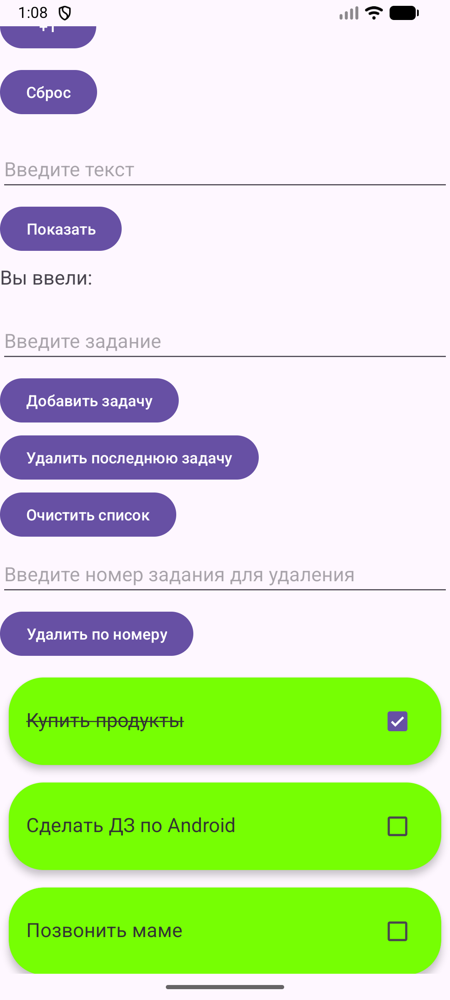
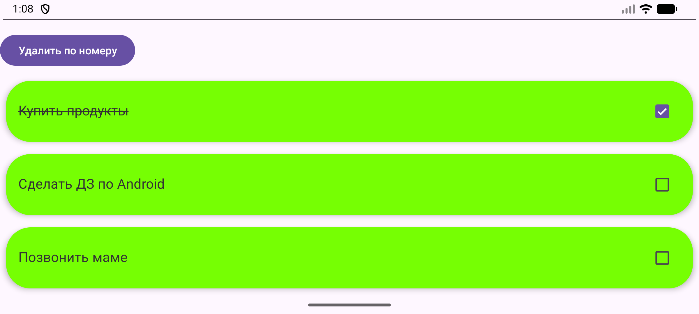
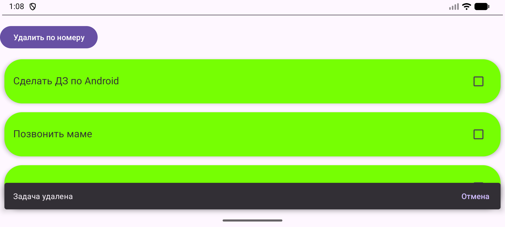

<div align="center">
МИНИСТЕРСТВО НАУКИ И ВЫСШЕГО ОБРАЗОВАНИЯ РОССИЙСКОЙ ФЕДЕРАЦИИ<br>
ФЕДЕРАЛЬНОЕ ГОСУДАРСТВЕННОЕ БЮДЖЕТНОЕ ОБРАЗОВАТЕЛЬНОЕ УЧРЕЖДЕНИЕ ВЫСШЕГО ОБРАЗОВАНИЯ<br>
«САХАЛИНСКИЙ ГОСУДАРСТВЕННЫЙ УНИВЕРСИТЕТ»
</div>


<br>
<br>

<div align="center">
Институт естественных наук и техносферной безопасности<br> 
Кафедра информатики<br>
Феофанов Артем
</div>


<br>
<br>
<br>
<br>

<div align="center">
Лабораторная работа №8<br>
«Перенос логики списка задач из Activity в ViewModel. Использование StateFlow для хранения состояния»<br>  
01.03.02 Прикладная математика и информатика
</div>

<br>
<br>
<br>
<br>
<br>
<br>
<br>
<br>
<br>
<br>
<br>
<br>
<br>

<div align="right">
Научный руководитель<br>
Соболев Евгений Игоревич
</div>

<br>
<br>
<br>

<div align="center">
г. Южно-Сахалинск<br>  
2026 г.
</div>

---

# Лабораторная работа №8
## Перенос логики списка задач из Activity в ViewModel. Использование StateFlow для хранения состояния

**Цель работы:** Изучить архитектурный компонент `ViewModel`, научиться выносить логику и состояние UI из `Activity`, использовать `StateFlow` для реактивного обновления данных, обеспечить сохранение состояния при изменении конфигурации.


## Листинг файлов

### Файл `MainViewModel.kt`

Был создан файл класса `MainViewModel.kt`, который хранит всю логику для `ViewModel`, методы по обработке задач.

```kotlin
package com.example.todoapp

import androidx.lifecycle.ViewModel
import kotlinx.coroutines.flow.MutableStateFlow
import kotlinx.coroutines.flow.StateFlow
import kotlinx.coroutines.flow.asStateFlow


data class Task(
    val text: String,
    val isChecked: Int = 0
)

class MainViewModel : ViewModel() {

    // Приватный изменяемый StateFlow с начальным значением (пустой список)
    private val _tasks = MutableStateFlow<List<Task>>(emptyList())

    // Публичный неизменяемый StateFlow для подписки из UI
    val tasks: StateFlow<List<Task>> = _tasks.asStateFlow()

    // Добавление новой задачи
    fun addTask(task: Task) {
        val currentList = _tasks.value.toMutableList()
        currentList.add(task)
        _tasks.value = currentList
    }

    // Удаление задачи по индексу
    fun deleteTask(index: Int) {
        val currentList = _tasks.value.toMutableList()
        if (index in currentList.indices) {
            currentList.removeAt(index)
            _tasks.value = currentList
        }
    }

    // Обновление текста задачи
    fun updateTask(index: Int, newText: String) {
        val currentList = _tasks.value.toMutableList()
        if (index in currentList.indices) {
            currentList[index] = Task(newText)
            _tasks.value = currentList
        }
    }

    fun restoreTask(index: Int, task: Task) {
        val currentList = _tasks.value.toMutableList()

        val safeIndex = index.coerceIn(0, currentList.size)
        currentList.add(safeIndex, task)
        _tasks.value = currentList
    }

    fun toggleTask(index: Int, isChecked: Boolean) {
        val currentList = _tasks.value.toMutableList()
        if (index in currentList.indices) {
            currentList[index] = currentList[index].copy(isChecked = if (isChecked) 1 else 0)
            _tasks.value = currentList
        }
    }

    fun clearTasks() {
        val currentList = _tasks.value.toMutableList()
        currentList.clear()
        _tasks.value = currentList
    }

    fun addAllTasks(tasks: List<Task>) {
        val currentList = _tasks.value.toMutableList()
        currentList.addAll(tasks)
        _tasks.value = currentList
    }

    // Вспомогательный метод для инициализации тестовыми данными (если нужно)
    fun loadTestData() {
        _tasks.value = listOf<Task>(
            Task("Купить продукты"),
            Task("Сделать ДЗ по Android"),
            Task("Позвонить маме"),
            Task("Записаться к врачу")
        )
    }
}
```

### Файл `MainActivity.kt`

В файле основной `Activity`, была добавлен `Snackbar` при удалении задачи по свайпу, отменяющий данную операцию. Также удалено взаимодействие с `SavedInstanceState` для сохранения данных, при переорганизации приложения. Все состояние хранится в `viewModel`.

```kotlin
package com.example.todoapp

import android.app.AlertDialog
import android.content.Intent
import android.os.Bundle
import androidx.activity.enableEdgeToEdge
import androidx.appcompat.app.AppCompatActivity
import androidx.core.view.ViewCompat
import androidx.core.view.WindowInsetsCompat
import android.widget.TextView
import android.widget.Button
import android.widget.EditText
import android.widget.Toast
import androidx.activity.result.contract.ActivityResultContracts
import androidx.activity.viewModels
import androidx.lifecycle.Lifecycle
import androidx.recyclerview.widget.LinearLayoutManager
import androidx.recyclerview.widget.RecyclerView
import androidx.recyclerview.widget.ItemTouchHelper
import androidx.lifecycle.lifecycleScope
import androidx.lifecycle.repeatOnLifecycle
import com.google.android.material.snackbar.Snackbar
import kotlinx.coroutines.launch

class MainActivity : AppCompatActivity() {
    private var counter = 0
    private val viewModel: MainViewModel by viewModels()
    private lateinit var adapter: TaskAdapter
    private val editTaskLauncher = registerForActivityResult(
        ActivityResultContracts.StartActivityForResult()
    ) { result ->
        if (result.resultCode == RESULT_OK) {
            val data = result.data
            val updatedText = data?.getStringExtra("updated_text")
            val position = data?.getIntExtra("task_position", -1) ?: -1
            val isDeleted = data?.getBooleanExtra("is_deleted", false) ?: false

            if (position != -1) {
                if (isDeleted) {
                    viewModel.deleteTask(position)
                    adapter.notifyItemRemoved(position)
                    adapter.notifyItemRangeChanged(position, viewModel.tasks.value.size - position)
                    Toast.makeText(this, "Задача удалена", Toast.LENGTH_SHORT).show()
                }
                else {
                    if (updatedText != null) {
                        viewModel.updateTask(position, updatedText)
                        adapter.notifyItemChanged(position)
                    }
                }
            }
        }
    }

    override fun onCreate(savedInstanceState: Bundle?) {
        super.onCreate(savedInstanceState)
        enableEdgeToEdge()
        setContentView(R.layout.activity_main)
        ViewCompat.setOnApplyWindowInsetsListener(findViewById(R.id.main)) { v, insets ->
            val systemBars = insets.getInsets(WindowInsetsCompat.Type.systemBars())
            v.setPadding(systemBars.left, systemBars.top, systemBars.right, systemBars.bottom)
            insets
        }

        val textCounter = findViewById<TextView>(R.id.textCounter)
        val buttonIncrement = findViewById<Button>(R.id.buttonIncrement)
        val buttonReset = findViewById<Button>(R.id.buttonReset)

        updateCounterDisplay(textCounter)

        buttonIncrement.setOnClickListener {
            counter++
            updateCounterDisplay(textCounter)
        }

        buttonReset.setOnClickListener {
            counter = 0
            updateCounterDisplay(textCounter)
        }

        val editTextInput = findViewById<EditText>(R.id.editTextInput)
        val buttonShow = findViewById<Button>(R.id.buttonShow)
        val textEntered = findViewById<TextView>(R.id.textEntered)

        buttonShow.setOnClickListener {
            val inputText = editTextInput.text.toString()
            textEntered.text = getString(R.string.label_entered) + " $inputText"
        }

        val editTextTask = findViewById<EditText>(R.id.editTextTask)
        val buttonAddTask = findViewById<Button>(R.id.buttonAddTask)
        val buttonDelLastTask = findViewById<Button>(R.id.buttonDelLastTask)
        val buttonDelTasks = findViewById<Button>(R.id.buttonDelTasks)
        val recyclerView = findViewById<RecyclerView>(R.id.recyclerViewTasks)

        recyclerView.layoutManager = LinearLayoutManager(this)
        adapter = TaskAdapter(tasks = mutableListOf<Task>(),
            onItemLongClick = { position ->
                showEditDialog(position)
            },
            onItemClick = { position ->
                val taskText = viewModel.tasks.value[position].text
                val intent = Intent(this, DetailActivity::class.java)
                intent.putExtra("task_text", taskText)
                intent.putExtra("task_position", position)
                editTaskLauncher.launch(intent)
            },
            onCheckedChange = { position, isChecked ->
                viewModel.toggleTask(position, isChecked)
            }
        )
        recyclerView.adapter = adapter

        lifecycleScope.launch {
            repeatOnLifecycle(Lifecycle.State.STARTED) {
                viewModel.tasks.collect { tasks ->
                    adapter.updateData(tasks) // предполагаем, что у адаптера есть такой метод
                }
            }
        }

        if (viewModel.tasks.value.isEmpty()) {
            viewModel.loadTestData()
        }

        val swipeHandler = object : ItemTouchHelper.SimpleCallback(0, ItemTouchHelper.LEFT) {
            var deletedTask: Task? = null
            var deletedPosition: Int = -1

            override fun onMove(
                rv: RecyclerView, vh: RecyclerView.ViewHolder, target: RecyclerView.ViewHolder
            ): Boolean = false

            override fun onSwiped(viewHolder: RecyclerView.ViewHolder, direction: Int) {
                val position = viewHolder.adapterPosition
                val tasks = viewModel.tasks.value

                deletedTask = tasks[position]
                deletedPosition = position

                viewModel.deleteTask(position)
                adapter.notifyItemRemoved(position)
                adapter.notifyItemRangeChanged(position, viewModel.tasks.value.size)

                Snackbar.make(
                    findViewById(R.id.main),
                    "Задача удалена",
                    Snackbar.LENGTH_LONG
                ).setAction("Отмена") {
                    deletedTask?.let { task ->
                        if (deletedPosition != -1) {
                            viewModel.restoreTask(deletedPosition, task)
                            adapter.notifyItemInserted(deletedPosition)
                            adapter.notifyItemRangeChanged(deletedPosition, viewModel.tasks.value.size - deletedPosition)
                        }
                    }
                    deletedTask = null
                    deletedPosition = -1
                }.show()
            }
        }

        val itemTouchHelper = ItemTouchHelper(swipeHandler)
        itemTouchHelper.attachToRecyclerView(recyclerView)

        buttonAddTask.setOnClickListener {
            val task = editTextTask.text.toString()
            if (task.isNotBlank()) {
                viewModel.addTask(Task(task))
                adapter.notifyItemInserted(viewModel.tasks.value.size - 1)
                editTextTask.text.clear()
            } else {
                Toast.makeText(this, "Введите задачу", Toast.LENGTH_SHORT).show()
            }
        }

        buttonDelLastTask.setOnClickListener {
            if (!viewModel.tasks.value.isEmpty()) {
                viewModel.deleteTask(viewModel.tasks.value.lastIndex)
                adapter.notifyItemRemoved(viewModel.tasks.value.size)
                editTextTask.text.clear()
            } else {
                Toast.makeText(this, "Список задач пуст", Toast.LENGTH_SHORT).show()
            }
        }

        buttonDelTasks.setOnClickListener {
            if (!viewModel.tasks.value.isEmpty()) {
                viewModel.clearTasks()
                adapter.notifyDataSetChanged()
                editTextTask.text.clear()
            } else {
                Toast.makeText(this, "Список задач пуст", Toast.LENGTH_SHORT).show()
            }
        }

        val textTaskId = findViewById<EditText>(R.id.editTextTaskId)
        val buttonDelTaskById = findViewById<Button>(R.id.buttonDelTaskById)

        buttonDelTaskById.setOnClickListener {
            val id = textTaskId.text.toString().toIntOrNull()

            if (id != null) {
                if (!viewModel.tasks.value.isEmpty()) {
                    if ((id - 1) >= 0 && (id - 1) < viewModel.tasks.value.size) {
                        viewModel.deleteTask(id - 1)
                        adapter.notifyItemRemoved(id - 1)
                        adapter.notifyItemRangeChanged(id - 1, viewModel.tasks.value.size - id - 1)
                        editTextTask.text.clear()
                    } else {
                        Toast.makeText(this, "Такой номер задачи не существует", Toast.LENGTH_SHORT).show()
                    }
                } else {
                    Toast.makeText(this, "Список задач пуст", Toast.LENGTH_SHORT).show()
                }
            } else {
                Toast.makeText(this, "Номер должен быть целым числом", Toast.LENGTH_SHORT).show()
            }
        }
    }

    private fun updateCounterDisplay(textView: TextView) {
        textView.text = getString(R.string.counter_text, counter)
    }

    private fun updateTasksDisplay(tasks: MutableList<String>, textTasks: TextView) {
        if (tasks.isEmpty()) {
            textTasks.text = getString(R.string.label_tasks)
        } else {
            textTasks.text = "Список задач:\n" + tasks.withIndex().joinToString("\n") { (index, task) -> "${index + 1}. $task" }
        }
    }

    fun showEditDialog(position: Int) {
        val task = viewModel.tasks.value[position]
        val editText = EditText(this)
        editText.setText(task.text)

        AlertDialog.Builder(this)
            .setTitle("Редактировать задачу")
            .setView(editText)
            .setPositiveButton("Сохранить") { _, _ ->
                val newTitle = editText.text.toString()
                if (newTitle.isNotEmpty()) {
                    viewModel.updateTask(position, newTitle)
                    adapter.notifyItemChanged(position)
                }
            }
            .setNegativeButton("Отмена", null)
            .show()
    }
}
```

### Файл `TaskAdapter.kt`

В файле адаптера была изменена логика для обеспечения работы с `viewModel`, добавлено сохранение состояния чек-боксов задач.

```kotlin
package com.example.todoapp

import android.graphics.Color
import android.view.LayoutInflater
import android.view.View
import android.view.ViewGroup
import android.widget.CheckBox
import android.widget.EditText
import android.widget.TextView
import androidx.cardview.widget.CardView
import androidx.recyclerview.widget.RecyclerView
import android.app.AlertDialog
import android.content.Context

class TaskAdapter(
    private var tasks: MutableList<Task>,
    private val onItemLongClick: (Int) -> Unit,
    private val onItemClick: (Int) -> Unit,
    private val onCheckedChange: (Int, Boolean) -> Unit
) : RecyclerView.Adapter<TaskAdapter.TaskViewHolder>() {

    // ViewHolder хранит ссылки на элементы внутри карточки
    class TaskViewHolder(itemView: View) : RecyclerView.ViewHolder(itemView) {
        val textTask: TextView = itemView.findViewById(R.id.textTask)
        val checkTask: CheckBox = itemView.findViewById(R.id.checkTask)
    }

    override fun onCreateViewHolder(parent: ViewGroup, viewType: Int): TaskViewHolder {
        val view = LayoutInflater.from(parent.context)
            .inflate(R.layout.item_task, parent, false)
        return TaskViewHolder(view)
    }

    override fun onBindViewHolder(holder: TaskViewHolder, position: Int) {
        val task = tasks[position]
        holder.textTask.text = task.text
        holder.checkTask.isChecked = task.isChecked != 0
        val color = if (position % 2 == 0) Color.WHITE else Color.LTGRAY
        (holder.itemView as? CardView)?.setCardBackgroundColor(color)

        if (holder.checkTask.isChecked) {
            holder.textTask.paintFlags = holder.textTask.paintFlags or android.graphics.Paint.STRIKE_THRU_TEXT_FLAG
        } else {
            holder.textTask.paintFlags = holder.textTask.paintFlags and android.graphics.Paint.STRIKE_THRU_TEXT_FLAG.inv()
        }

        // Обработка чекбокса (опционально)
        holder.checkTask.setOnCheckedChangeListener(null)
        holder.checkTask.setOnCheckedChangeListener { _, isChecked ->
            // Можно добавить логику отметки выполнения, например, перечеркивание текста
            if (isChecked) {
                holder.textTask.paintFlags = holder.textTask.paintFlags or android.graphics.Paint.STRIKE_THRU_TEXT_FLAG
            } else {
                holder.textTask.paintFlags = holder.textTask.paintFlags and android.graphics.Paint.STRIKE_THRU_TEXT_FLAG.inv()
            }

            onCheckedChange(position, isChecked)
        }

        holder.itemView.setOnLongClickListener {
            onItemLongClick(position)
            true
        }

        holder.itemView.setOnClickListener {
            onItemClick(position)
        }

    }

    override fun getItemCount(): Int = tasks.size

    // Метод для обновления списка
    fun updateData(newTasks: List<Task>) {
        tasks.clear()
        tasks.addAll(newTasks)
        notifyDataSetChanged()
    }
}
```

## Скриншоты работающего приложения





## Контрольные вопросы

1. `ViewModel` – это компонент архитектуры `Android`, предназначенный для хранения и управления данными, связанными с UI, с учётом жизненного цикла. `ViewModel` переживает повороты экрана и другие изменения конфигурации, что предотвращает потерю данных.

2. `StateFlow` – это поток данных из библиотеки `Kotlin Coroutines`, который всегда хранит последнее значение и уведомляет подписчиков о новых значениях. Является отличной альтернативой `LiveData` в чисто Kotlin-проектах, особенно при использовании корутин. Если ваш проект написан на `Java`, `Flow` там использовать не получится. `Jetpack Compose` «родной» для `Flow`, и работа со `StateFlow` там выглядит максимально естественно. Если вы просто подпишетесь на `StateFlow` в `onCreate`, он будет продолжать слать обновления и тратить ресурсы, когда приложение свернуто. Поэтому в `Activity` мы используем специальный паттерн:
```kotlin
lifecycleScope.launch {
    repeatOnLifecycle(Lifecycle.State.STARTED) {
        viewModel.tasks.collect { tasks ->
            // Обновляем UI только когда экран виден пользователю
        }
    }
}
```

3. `lifecycleScope` - это встроенная область видимости, которая привязана к жизненному циклу `Activity`. Как только `Activity` уничтожается (`onDestroy`), `lifecycleScope` автоматически отменяет все запущенные в нем задачи. Это предотвращает утечки памяти. `repeatOnLifecycle` - это «умный» оператор, который управляет выполнением кода в зависимости от состояния экрана, например, чтобы не обновлять UI, когда его не видно. Когда мы используем параметр `State.STARTED`, код внутри блока начнет выполняться, как только `Activity` появится на экране.

4. Обновление данных в `StateFlow` - это процесс замены одного неизменяемого состояния на другое. Поскольку `StateFlow` проектировался для многопоточной среды, есть несколько способов сделать это правильно:
    1. через `.value` (новое состояние не зависит от старого; работаем в одном потоке):
    ```kotlin
    _tasks.value = newList
    ```
    2. функция `.update { ... }` (атомарная и потокобезопасная):
    ```kotlin
    // Во ViewModel
    fun addTask(text: String) {
        _tasks.update { currentList ->
            currentList + Task(text) // Создает новый список на основе старого
        }
    }
    ```
    3. оператор `+` и `-` (копию списка с добавленным или удаленным элементом):
    ```kotlin
    // Добавить элемент
    _tasks.value += Task("Новая задача")

    // Удалить элемент (если Task - data class и совпадает по значениям)
    _tasks.value -= someTask
    ```

5. Вынос логики в `ViewModel` - это один из самых эффективных способов сделать код тестируемым. `ViewModel` не зависит от классов Android, если она написана правильно. Нужно просто создать экземпляр класса в обычном `JUnit`-тесте. Например, можно проверить, что при вызове `addTask("Купить хлеб")` в `StateFlow` действительно появилась новая задача.

## Вывод
В ходе выполнения лабораторной работы я освоил принципы работы c `ViewModel` и `StateFlow`. Мною был реализован класс `MainViewModel`, куда вынес логику управления списком задач (добавление, удаление, обновление). В процессе работы была решена проблема потери данных при пересоздании `Activity` и исключена вероятность возникновения утечек памяти за счет использования автоматической отмены корутин в `lifecycleScope`. Также был изменен `TaskAdapter`, который теперь сохраняет состояние чекбоксов при перестройке `Activity`.