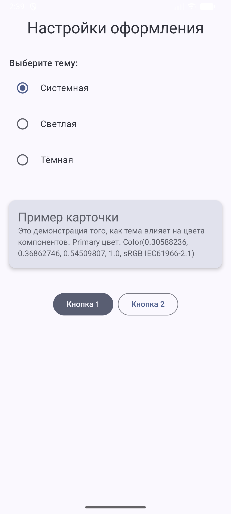
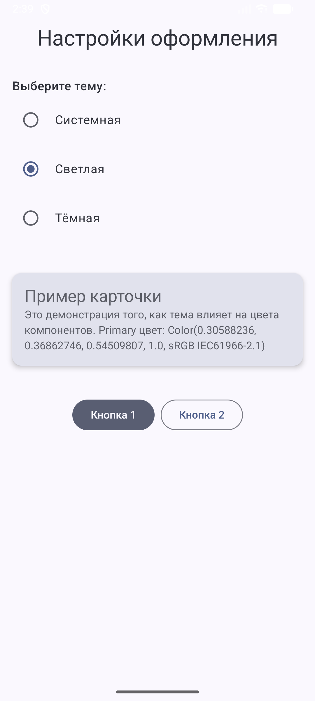
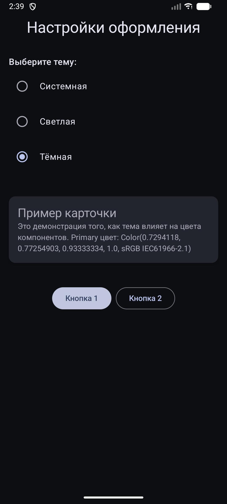

<div align="center">
МИНИСТЕРСТВО НАУКИ И ВЫСШЕГО ОБРАЗОВАНИЯ РОССИЙСКОЙ ФЕДЕРАЦИИ<br>
ФЕДЕРАЛЬНОЕ ГОСУДАРСТВЕННОЕ БЮДЖЕТНОЕ ОБРАЗОВАТЕЛЬНОЕ УЧРЕЖДЕНИЕ ВЫСШЕГО ОБРАЗОВАНИЯ<br>
«САХАЛИНСКИЙ ГОСУДАРСТВЕННЫЙ УНИВЕРСИТЕТ»
</div>


<br>
<br>

<div align="center">
Институт естественных наук и техносферной безопасности<br> 
Кафедра информатики<br>
Феофанов Артем
</div>


<br>
<br>
<br>
<br>

<div align="center">
Лабораторная работа №9<br>
«Сохранение настроек темы. Тёмная/светлая тема в Compose»<br>  
01.03.02 Прикладная математика и информатика
</div>

<br>
<br>
<br>
<br>
<br>
<br>
<br>
<br>
<br>
<br>
<br>
<br>
<br>

<div align="right">
Научный руководитель<br>
Соболев Евгений Игоревич
</div>

<br>
<br>
<br>

<div align="center">
г. Южно-Сахалинск<br>  
2026 г.
</div>

---

# Лабораторная работа №9
## Сохранение настроек темы. Тёмная/светлая тема в Compose

**Цель работы:** Изучить механизмы смены и сохранения темы приложения в `Jetpack Compose`, научиться использовать `DataStore/SharedPreferences` для хранения пользовательских настроек, реализовать переключение между тёмной и светлой темами.


## Листинг файлов

### Файл `Color.kt`

Был создан файл `Color.kt`, который хранит две цветовые схемы: для светлой и тёмной темы.

```kotlin
package com.example.themeswitcher.ui.theme

import androidx.compose.ui.graphics.Color
import androidx.compose.material3.*

// Светлая тема
val LightColors = lightColorScheme(
    primary = Color(0xFF006C4C),
    onPrimary = Color(0xFFFFFFFF),
    primaryContainer = Color(0xFF89F8C7),
    onPrimaryContainer = Color(0xFF002114),
    secondary = Color(0xFF4D635A),
    onSecondary = Color(0xFFFFFFFF),
    secondaryContainer = Color(0xFFCFE9DD),
    onSecondaryContainer = Color(0xFF0A1F19),
    tertiary = Color(0xFF3A637A),
    onTertiary = Color(0xFFFFFFFF),
    tertiaryContainer = Color(0xFFC1E8FF),
    onTertiaryContainer = Color(0xFF001E2C),
    background = Color(0xFFF4FBF5),
    onBackground = Color(0xFF161D1A),
    surface = Color(0xFFF4FBF5),
    onSurface = Color(0xFF161D1A)
)

// Тёмная тема
val DarkColors = darkColorScheme(
    primary = Color(0xFF6CDBB0),
    onPrimary = Color(0xFF003825),
    primaryContainer = Color(0xFF005239),
    onPrimaryContainer = Color(0xFF89F8C7),
    secondary = Color(0xFFB3CCC1),
    onSecondary = Color(0xFF1F352D),
    secondaryContainer = Color(0xFF354B43),
    onSecondaryContainer = Color(0xFFCFE9DD),
    tertiary = Color(0xFF9DC9E5),
    onTertiary = Color(0xFF003549),
    tertiaryContainer = Color(0xFF1F4B63),
    onTertiaryContainer = Color(0xFFC1E8FF),
    background = Color(0xFF161D1A),
    onBackground = Color(0xFFE1E3DF),
    surface = Color(0xFF161D1A),
    onSurface = Color(0xFFE1E3DF)
)
```

### Файл `Theme.kt`

В файле `Theme.kt` была изменена логика для обеспечения работы с `ViewModel` и `DataStore`.

```kotlin
package com.example.themeswitcher.ui.theme

import android.os.Build
import androidx.compose.foundation.isSystemInDarkTheme
import androidx.compose.material3.MaterialTheme
import androidx.compose.material3.dynamicDarkColorScheme
import androidx.compose.material3.dynamicLightColorScheme
import androidx.compose.runtime.Composable
import androidx.compose.runtime.collectAsState
import androidx.compose.runtime.getValue
import androidx.compose.ui.platform.LocalContext
import androidx.lifecycle.viewmodel.compose.viewModel

@Composable
fun ThemeSwitcherTheme(
    viewModel: ThemeViewModel = viewModel(),
    content: @Composable () -> Unit
) {
    val context = LocalContext.current
    // Получаем ID темы
    val themeMode by viewModel.themeMode.collectAsState()

    // Должна ли тема быть темной в данный момент
    val isDarkTheme = when (themeMode) {
        1 -> false // Светлая
        2 -> true  // Темная
        else -> isSystemInDarkTheme() // 0 или системная
    }

    val colorScheme = when {
        Build.VERSION.SDK_INT >= Build.VERSION_CODES.S -> {
            if (isDarkTheme) dynamicDarkColorScheme(context) else dynamicLightColorScheme(context)
        }
        isDarkTheme -> DarkColors
        else -> LightColors
    }

    MaterialTheme(
        colorScheme = colorScheme,
        content = content
    )
}
```

### Файл `SettingsManager.kt`

Был создан файл `SettingsManager.kt` для управления настройками через `DataStore`.

```kotlin
package com.example.themeswitcher.data

import android.content.Context
import androidx.datastore.preferences.core.edit
import androidx.datastore.preferences.core.intPreferencesKey
import androidx.datastore.preferences.preferencesDataStore
import kotlinx.coroutines.flow.Flow
import kotlinx.coroutines.flow.map

val Context.dataStore by preferencesDataStore(name = "settings")

class SettingsManager(private val context: Context) {
    companion object {
        val THEME_MODE_KEY = intPreferencesKey("theme_mode")
    }

    // 0 - Системная, 1 - Светлая, 2 - Темная
    val themeMode: Flow<Int> = context.dataStore.data
        .map { preferences ->
            preferences[THEME_MODE_KEY] ?: 0
        }

    suspend fun saveThemeMode(mode: Int) {
        context.dataStore.edit { preferences ->
            preferences[THEME_MODE_KEY] = mode
        }
    }
}
```

### Файл `ThemeViewModel.kt`

Был создан файл `ThemeViewModel.kt` для хранения `ViewModel` для темы.

```kotlin
package com.example.themeswitcher.ui.theme

import androidx.lifecycle.ViewModel
import androidx.lifecycle.viewModelScope
import com.example.themeswitcher.data.SettingsManager
import kotlinx.coroutines.flow.SharingStarted
import kotlinx.coroutines.flow.StateFlow
import kotlinx.coroutines.flow.stateIn
import kotlinx.coroutines.launch

class ThemeViewModel(private val settingsManager: SettingsManager) : ViewModel() {

    val themeMode: StateFlow<Int> = settingsManager.themeMode
        .stateIn(
            scope = viewModelScope,
            started = SharingStarted.WhileSubscribed(5000),
            initialValue = 0
        )

    fun setThemeMode(mode: Int) {
        viewModelScope.launch {
            settingsManager.saveThemeMode(mode)
        }
    }
}
```

### Файл `MainActivity.kt`

В файле основной `Activity` создан простой интерфейс с переключателями темы на `Системную`, `Светлую` и `Темную` при помощи `RadioButton`.

```kotlin
package com.example.themeswitcher

import android.os.Bundle
import androidx.activity.ComponentActivity
import androidx.activity.compose.setContent
import androidx.compose.foundation.layout.*
import androidx.compose.foundation.selection.selectable
import androidx.compose.material3.*
import androidx.compose.runtime.*
import androidx.compose.ui.Alignment
import androidx.compose.ui.Modifier
import androidx.compose.ui.unit.dp
import androidx.lifecycle.viewmodel.compose.viewModel
import com.example.themeswitcher.data.SettingsManager
import com.example.themeswitcher.ui.theme.ThemeSwitcherTheme
import com.example.themeswitcher.ui.theme.ThemeViewModel
import com.example.themeswitcher.ui.theme.ThemeViewModelFactory

class MainActivity : ComponentActivity() {
    override fun onCreate(savedInstanceState: Bundle?) {
        super.onCreate(savedInstanceState)

        // Инициализация SettingsManager
        val settingsManager = SettingsManager(this)

        setContent {
            ThemeSwitcherTheme(
                viewModel = viewModel(factory = ThemeViewModelFactory(settingsManager))
            ) {
                Surface(
                    modifier = Modifier.fillMaxSize(),
                    color = MaterialTheme.colorScheme.background
                ) {
                    ThemeScreen()
                }
            }
        }
    }
}

@Composable
fun ThemeScreen(viewModel: ThemeViewModel = viewModel()) {
    Column(
        modifier = Modifier.fillMaxSize(),
        horizontalAlignment = Alignment.CenterHorizontally
    ) {
        Text(
            text = "Настройки оформления",
            style = MaterialTheme.typography.headlineMedium,
            modifier = Modifier.padding(top = 32.dp)
        )

        Spacer(modifier = Modifier.height(16.dp))

        val currentTheme by viewModel.themeMode.collectAsState()
        val themeOptions = listOf("Системная", "Светлая", "Тёмная")

        Column(modifier = Modifier.padding(16.dp)) {
            Text("Выберите тему:", style = MaterialTheme.typography.titleMedium)

            themeOptions.forEachIndexed { index, title ->
                Row(
                    verticalAlignment = Alignment.CenterVertically,
                    modifier = Modifier
                        .fillMaxWidth()
                        .selectable(
                            selected = currentTheme == index,
                            onClick = { viewModel.setThemeMode(index) }
                        )
                        .padding(vertical = 8.dp)
                ) {
                    RadioButton(
                        selected = currentTheme == index,
                        onClick = { viewModel.setThemeMode(index) }
                    )
                    Spacer(modifier = Modifier.width(8.dp))
                    Text(text = title)
                }
            }
        }

        Spacer(modifier = Modifier.height(8.dp))

        Card(
            modifier = Modifier.fillMaxWidth().padding(16.dp),
            elevation = CardDefaults.cardElevation(defaultElevation = 4.dp)
        ) {
            Column(
                modifier = Modifier.padding(16.dp)
            ) {
                Text(
                    text = "Пример карточки",
                    style = MaterialTheme.typography.titleLarge
                )
                Text(
                    text = "Это демонстрация того, как тема влияет на цвета компонентов. " +
                            "Primary цвет: ${MaterialTheme.colorScheme.primary}",
                    style = MaterialTheme.typography.bodyMedium
                )
            }
        }

        Spacer(modifier = Modifier.height(24.dp))

        Row(
            horizontalArrangement = Arrangement.spacedBy(8.dp)
        ) {
            Button(
                onClick = { /* Действие 1 */ },
                colors = ButtonDefaults.buttonColors(
                    containerColor = MaterialTheme.colorScheme.secondary
                )
            ) {
                Text("Кнопка 1")
            }

            OutlinedButton(
                onClick = { /* Действие 2 */ }
            ) {
                Text("Кнопка 2")
            }
        }
    }
}

```

## Скриншоты работающего приложения





## Контрольные вопросы

1. Для определения системной темы используется встроенная функция `isSystemInDarkTheme()`. Она возвращает `true`, если на уровне настроек операционной системы устройства включен тёмный режим, и `false` в противном случае.

2. `MaterialTheme.colorScheme` - это объект, который содержит полную палитру цветов, используемых компонентами `Material Design`. Основные цвета:
    * `primary`, `secondary`, `tertiary` - ключевые акцентные цвета;
    * `background` - базовый цвет фона экрана;
    * `surface` - цвет поверхностей (карточки, модальные окна);
    * `error` - цвет для обозначения ошибок;
    * Цвета с приставкой `on` (например, `onPrimary`, `onBackground`) - цвета для текста и иконок, которые располагаются поверх соответствующих фонов.

3. В современных Android-приложениях рекомендуется использовать `Jetpack DataStore`, который работает асинхронно с использованием `Kotlin Coroutines` и `Flow`. Он является заменой устаревающим `SharedPreferences`.

4. `isSystemInDarkTheme()` отражает глобальную настройку всей операционной системы `Android`. Сохраненный пользовательский выбор (например, в `DataStore`) - это локальная настройка конкретного приложения. Приложение может игнорировать системную настройку, если пользователь явно выбрал принудительную светлую или тёмную тему внутри самого приложения.

5. Динамические цвета (`Material You Dynamic Color`) — это алгоритм, который генерирует уникальную цветовую палитру приложения на основе доминирующих цветов обоев рабочего стола пользователя. Эта функция поддерживается на устройствах под управлением `Android 12` (`API 31`) и выше.

## Вывод
В ходе выполнения лабораторной работы были изучены основные механизмы стилизации и управления темами в `Jetpack Compose`. Я ознакомился с устройством `MaterialTheme` и принципами создания цветовых схем для светлого и тёмного режимов. На практике был реализован механизм переключения тем, а также их сохранение между сессиями с использованием современной библиотеки `Jetpack DataStore`. Была освоена интеграция `DataStore` с `ViewModel` для обновления `UI` при изменении настроек. В рамках индивидуального задания реализован выбор из трех режимов.